## Contents
{:.no_toc}
*  
{: toc}


**We performed our EDA using data from the Spotify API. The API featured "metadata in JSON format about artists, albums, and tracks directly from the Spotify catalogue".** 


The data used below for our EDA features 1585 playlists that we accessed using the Spotipy package, enabling us to pull data on Spotify's own curated playlists. We analyzed data on these playlists with all of their songs, as well as their artist name, whether they were explicit or not, duration, the artist's popularity (if there were multiple artists we only took the first artist) and number of followers, as well as the genres that the artist is classified under.


<div>
<table border="1" class="dataframe">
  <thead>
    <tr style="text-align: right;">
      <th></th>
      <th>playlist_id</th>
      <th>playlist_name</th>
      <th>followers</th>
      <th>song_name</th>
      <th>number_of_artists</th>
      <th>artist_name</th>
      <th>artist_id</th>
      <th>popularity</th>
      <th>track_number</th>
      <th>explicit</th>
      <th>duration_ms</th>
      <th>available_markets</th>
      <th>delete</th>
      <th>artist_popularity</th>
      <th>artist_followers</th>
      <th>artist_genres</th>
    </tr>
  </thead>
  <tbody>
    <tr>
      <th>0</th>
      <td>37i9dQZF1DXcBWIGoYBM5M</td>
      <td>Today's Top Hits</td>
      <td>18123888.0</td>
      <td>Wolves</td>
      <td>2</td>
      <td>Selena Gomez</td>
      <td>0C8ZW7ezQVs4URX5aX7Kqx</td>
      <td>88</td>
      <td>1</td>
      <td>0</td>
      <td>197993</td>
      <td>['AD', 'AR', 'AT', 'AU', 'BE', 'BG', 'BO', 'BR...</td>
      <td>NaN</td>
      <td>93.0</td>
      <td>6817859.0</td>
      <td>['dance pop', 'pop', 'post-teen pop']</td>
    </tr>
    <tr>
      <th>1</th>
      <td>37i9dQZF1DWXDAhqlN7e6W</td>
      <td>This Is: Max Martin</td>
      <td>15685.0</td>
      <td>Hands To Myself</td>
      <td>1</td>
      <td>Selena Gomez</td>
      <td>0C8ZW7ezQVs4URX5aX7Kqx</td>
      <td>69</td>
      <td>3</td>
      <td>0</td>
      <td>200680</td>
      <td>['AD', 'AR', 'AT', 'AU', 'BE', 'BG', 'BO', 'BR...</td>
      <td>NaN</td>
      <td>93.0</td>
      <td>6817859.0</td>
      <td>['dance pop', 'pop', 'post-teen pop']</td>
    </tr>
    <tr>
      <th>2</th>
      <td>37i9dQZF1DX7Q7o98uPeg1</td>
      <td>Funkst</td>
      <td>397098.0</td>
      <td>Good For You - KASBO Remix</td>
      <td>3</td>
      <td>Selena Gomez</td>
      <td>0C8ZW7ezQVs4URX5aX7Kqx</td>
      <td>35</td>
      <td>3</td>
      <td>0</td>
      <td>221560</td>
      <td>['AD', 'AR', 'AT', 'AU', 'BE', 'BG', 'BO', 'BR...</td>
      <td>NaN</td>
      <td>93.0</td>
      <td>6817859.0</td>
      <td>['dance pop', 'pop', 'post-teen pop']</td>
    </tr>
    <tr>
      <th>3</th>
      <td>37i9dQZF1DX3LyU0mhfqgP</td>
      <td>Out Now</td>
      <td>439685.0</td>
      <td>Wolves</td>
      <td>2</td>
      <td>Selena Gomez</td>
      <td>0C8ZW7ezQVs4URX5aX7Kqx</td>
      <td>88</td>
      <td>1</td>
      <td>0</td>
      <td>197993</td>
      <td>['AD', 'AR', 'AT', 'AU', 'BE', 'BG', 'BO', 'BR...</td>
      <td>NaN</td>
      <td>93.0</td>
      <td>6817859.0</td>
      <td>['dance pop', 'pop', 'post-teen pop']</td>
    </tr>
    <tr>
      <th>4</th>
      <td>37i9dQZF1DX35oM5SPECmN</td>
      <td>HIIT Workout</td>
      <td>712771.0</td>
      <td>Come &amp; Get It</td>
      <td>1</td>
      <td>Selena Gomez</td>
      <td>0C8ZW7ezQVs4URX5aX7Kqx</td>
      <td>56</td>
      <td>1</td>
      <td>0</td>
      <td>231733</td>
      <td>['AD', 'AR', 'AT', 'AU', 'BE', 'BG', 'BO', 'BR...</td>
      <td>NaN</td>
      <td>93.0</td>
      <td>6817859.0</td>
      <td>['dance pop', 'pop', 'post-teen pop']</td>
    </tr>
  </tbody>
</table>
</div>


We appended indicator variables to tell us whether a song in a playlist could be classified as a pop/rap/rock song, as well as if the song was written by a popular artist. We defined a “popular artist” as one ranked by Spotify as above 75 on an artist popularity scale of 1-100 (since this was the third quartile value). 


We aggregated the data from individual songs into averages across entire playlists. These conglomerated metrics include the playlist’s ID, the playlist name, total followers, average artist followers, percent explicit, number of songs, percent of playlist that is a certain genre (pop, rap, rock, etc), percent popular artists, average song duration, average song popularity (scale of 1-100).


<div>
<table border="1" class="dataframe">
  <thead>
    <tr style="text-align: right;">
      <th></th>
      <th>playlist</th>
      <th>name</th>
      <th>followers</th>
      <th>num_songs</th>
      <th>av_song_pop</th>
      <th>pct_explicit</th>
      <th>avg_dur</th>
      <th>av_artist_followers</th>
      <th>pop_pct</th>
      <th>rap_pct</th>
      <th>rock_pct</th>
      <th>popular_artist_pct</th>
    </tr>
  </thead>
  <tbody>
    <tr>
      <th>0</th>
      <td>37i9dQZF1DXcBWIGoYBM5M</td>
      <td>0       Today's Top Hits
47      Today's Top H...</td>
      <td>1.81239e+07</td>
      <td>50</td>
      <td>82.38</td>
      <td>0.34</td>
      <td>208121</td>
      <td>2.75535e+06</td>
      <td>0.8</td>
      <td>0.06</td>
      <td>0</td>
      <td>1</td>
    </tr>
    <tr>
      <th>1</th>
      <td>37i9dQZF1DWXDAhqlN7e6W</td>
      <td>1        This Is: Max Martin
125      This Is:...</td>
      <td>15685</td>
      <td>44</td>
      <td>55.5227</td>
      <td>0.113636</td>
      <td>220925</td>
      <td>3.99045e+06</td>
      <td>0.977273</td>
      <td>0</td>
      <td>0.0227273</td>
      <td>0.75</td>
    </tr>
    <tr>
      <th>2</th>
      <td>37i9dQZF1DX7Q7o98uPeg1</td>
      <td>2        Funkst
2500     Funkst
2569     Funks...</td>
      <td>397098</td>
      <td>100</td>
      <td>32.87</td>
      <td>0.09</td>
      <td>241358</td>
      <td>319005</td>
      <td>0.12</td>
      <td>0.42</td>
      <td>0.02</td>
      <td>0.08</td>
    </tr>
    <tr>
      <th>3</th>
      <td>37i9dQZF1DX3LyU0mhfqgP</td>
      <td>3        Out Now
48       Out Now
267      Out...</td>
      <td>439685</td>
      <td>55</td>
      <td>71.7273</td>
      <td>0.181818</td>
      <td>207392</td>
      <td>1.02241e+06</td>
      <td>0.654545</td>
      <td>0</td>
      <td>0</td>
      <td>0.6</td>
    </tr>
    <tr>
      <th>4</th>
      <td>37i9dQZF1DX35oM5SPECmN</td>
      <td>4        HIIT Workout
129      HIIT Workout
48...</td>
      <td>712771</td>
      <td>50</td>
      <td>59.06</td>
      <td>0.12</td>
      <td>223608</td>
      <td>3.32207e+06</td>
      <td>0.9</td>
      <td>0</td>
      <td>0.04</td>
      <td>0.62</td>
    </tr>
  </tbody>
</table>
</div>


<div>
<table border="1" class="dataframe">
  <thead>
    <tr style="text-align: right;">
      <th></th>
      <th>followers</th>
      <th>num_songs</th>
      <th>av_song_pop</th>
      <th>pct_explicit</th>
      <th>avg_dur</th>
      <th>av_artist_followers</th>
      <th>pop_pct</th>
      <th>rap_pct</th>
      <th>rock_pct</th>
      <th>popular_artist_pct</th>
      <th>log_followers</th>
      <th>log_artist_follow</th>
    </tr>
  </thead>
  <tbody>
    <tr>
      <th>count</th>
      <td>1.584000e+03</td>
      <td>1584.000000</td>
      <td>1584.000000</td>
      <td>1584.000000</td>
      <td>1.584000e+03</td>
      <td>1.584000e+03</td>
      <td>1584.000000</td>
      <td>1584.000000</td>
      <td>1584.000000</td>
      <td>1584.000000</td>
      <td>1584.000000</td>
      <td>1584.000000</td>
    </tr>
    <tr>
      <th>mean</th>
      <td>2.142093e+05</td>
      <td>52.605429</td>
      <td>38.331537</td>
      <td>0.088401</td>
      <td>2.657999e+05</td>
      <td>9.070557e+05</td>
      <td>0.438389</td>
      <td>0.028073</td>
      <td>0.146948</td>
      <td>0.278765</td>
      <td>9.574142</td>
      <td>12.456636</td>
    </tr>
    <tr>
      <th>std</th>
      <td>6.863399e+05</td>
      <td>25.069536</td>
      <td>15.897419</td>
      <td>0.185671</td>
      <td>1.679411e+05</td>
      <td>1.368342e+06</td>
      <td>0.358942</td>
      <td>0.094440</td>
      <td>0.242333</td>
      <td>0.316079</td>
      <td>3.254485</td>
      <td>2.118953</td>
    </tr>
    <tr>
      <th>min</th>
      <td>0.000000e+00</td>
      <td>5.000000</td>
      <td>0.000000</td>
      <td>0.000000</td>
      <td>3.962875e+04</td>
      <td>9.000000e+00</td>
      <td>0.000000</td>
      <td>0.000000</td>
      <td>0.000000</td>
      <td>0.000000</td>
      <td>0.000000</td>
      <td>2.197225</td>
    </tr>
    <tr>
      <th>25%</th>
      <td>1.746250e+03</td>
      <td>32.000000</td>
      <td>27.724700</td>
      <td>0.000000</td>
      <td>2.146209e+05</td>
      <td>9.689143e+04</td>
      <td>0.040000</td>
      <td>0.000000</td>
      <td>0.000000</td>
      <td>0.010000</td>
      <td>7.465226</td>
      <td>11.481337</td>
    </tr>
    <tr>
      <th>50%</th>
      <td>3.029700e+04</td>
      <td>50.000000</td>
      <td>39.426216</td>
      <td>0.010000</td>
      <td>2.327892e+05</td>
      <td>3.867883e+05</td>
      <td>0.453229</td>
      <td>0.000000</td>
      <td>0.033333</td>
      <td>0.150000</td>
      <td>10.318803</td>
      <td>12.865618</td>
    </tr>
    <tr>
      <th>75%</th>
      <td>1.628768e+05</td>
      <td>66.000000</td>
      <td>49.196341</td>
      <td>0.084105</td>
      <td>2.581028e+05</td>
      <td>1.116790e+06</td>
      <td>0.763927</td>
      <td>0.000000</td>
      <td>0.180000</td>
      <td>0.460000</td>
      <td>12.000749</td>
      <td>13.925968</td>
    </tr>
    <tr>
      <th>max</th>
      <td>1.812389e+07</td>
      <td>100.000000</td>
      <td>82.380000</td>
      <td>1.000000</td>
      <td>2.507284e+06</td>
      <td>1.424941e+07</td>
      <td>1.000000</td>
      <td>1.000000</td>
      <td>1.000000</td>
      <td>1.000000</td>
      <td>16.712741</td>
      <td>16.472226</td>
    </tr>
  </tbody>
</table>
</div>


## Exploring the distribution of followers


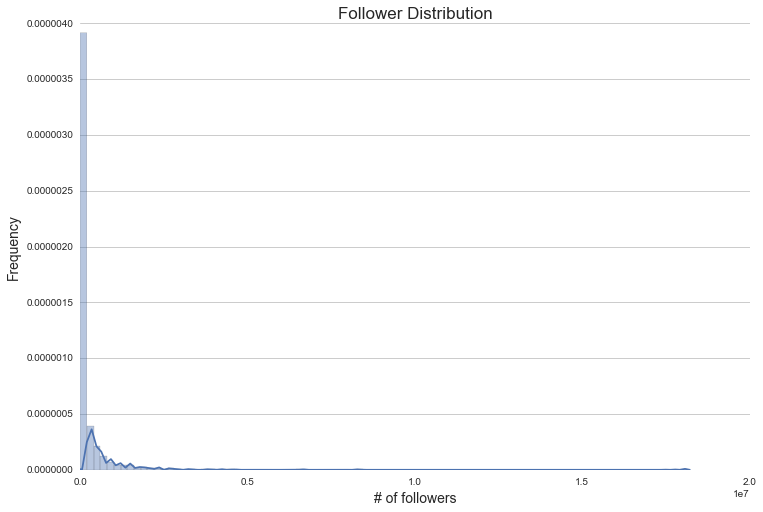


It's apparent here that the response variable (number of followers) is extremely right skewed. Some playlists, such as "Today's Top Hits", were upper outliers that were magnitudes greater in number of follweres than other popular playlists. We address this skewness by log-transforming the number of followers. As seen below, taking the log of our response makes its distribution roughly normal. In addition, it allows us to work on a much easier scale than the untransformed response variable.


```python
eda_frame.sort_values(by= 'followers', ascending = False)
```


<div>
<table border="1" class="dataframe">
  <thead>
    <tr style="text-align: right;">
      <th></th>
      <th>playlist</th>
      <th>name</th>
      <th>followers</th>
      <th>num_songs</th>
      <th>av_song_pop</th>
      <th>pct_explicit</th>
      <th>avg_dur</th>
      <th>av_artist_followers</th>
      <th>pop_pct</th>
      <th>rap_pct</th>
      <th>rock_pct</th>
      <th>popular_artist_pct</th>
      <th>log_followers</th>
      <th>log_artist_follow</th>
    </tr>
  </thead>
  <tbody>
    <tr>
      <th>0</th>
      <td>37i9dQZF1DXcBWIGoYBM5M</td>
      <td>0       Today's Top Hits
47      Today's Top H...</td>
      <td>18123888.0</td>
      <td>50</td>
      <td>82.380000</td>
      <td>0.340000</td>
      <td>2.081208e+05</td>
      <td>2.755345e+06</td>
      <td>0.800000</td>
      <td>0.060000</td>
      <td>0.000000</td>
      <td>1.000000</td>
      <td>16.712741</td>
      <td>14.829053</td>
    </tr>
    <tr>
      <th>48</th>
      <td>37i9dQZF1DX0XUsuxWHRQd</td>
      <td>67      RapCaviar
411     RapCaviar
468     Ra...</td>
      <td>8318573.0</td>
      <td>51</td>
      <td>75.568627</td>
      <td>0.980392</td>
      <td>2.119144e+05</td>
      <td>1.561226e+06</td>
      <td>0.529412</td>
      <td>0.294118</td>
      <td>0.000000</td>
      <td>0.862745</td>
      <td>15.934001</td>
      <td>14.260982</td>
    </tr>
    <tr>
      <th>66</th>
      <td>37i9dQZF1DX10zKzsJ2jva</td>
      <td>105     ÌâåÁViva Latino!
702     ÌâåÁViva Lati...</td>
      <td>6634680.0</td>
      <td>50</td>
      <td>79.660000</td>
      <td>0.000000</td>
      <td>2.172563e+05</td>
      <td>1.790468e+06</td>
      <td>0.500000</td>
      <td>0.100000</td>
      <td>0.020000</td>
      <td>0.940000</td>
      <td>15.707821</td>
      <td>14.397987</td>
    </tr>
    <tr>
      <th>218</th>
      <td>37i9dQZF1DX4dyzvuaRJ0n</td>
      <td>772     mint
938     mint
939     mint
1026   ...</td>
      <td>4599874.0</td>
      <td>50</td>
      <td>61.040000</td>
      <td>0.020000</td>
      <td>2.114293e+05</td>
      <td>6.840229e+05</td>
      <td>0.240000</td>
      <td>0.100000</td>
      <td>0.000000</td>
      <td>0.380000</td>
      <td>15.341539</td>
      <td>13.435747</td>
    </tr>
    <tr>
      <th>148</th>
      <td>37i9dQZF1DX1lVhptIYRda</td>
      <td>381     Hot Country
4834    Hot Country
4843  ...</td>
      <td>4252701.0</td>
      <td>51</td>
      <td>66.705882</td>
      <td>0.000000</td>
      <td>1.960043e+05</td>
      <td>3.817110e+05</td>
      <td>0.039216</td>
      <td>0.000000</td>
      <td>0.490196</td>
      <td>0.470588</td>
      <td>15.263065</td>
      <td>12.852419</td>
    </tr>
    <tr>
      <th>375</th>
      <td>37i9dQZF1DXcF6B6QPhFDv</td>
      <td>2392    Rock This
3503    Rock This
3512    Ro...</td>
      <td>3995196.0</td>
      <td>50</td>
      <td>60.240000</td>
      <td>0.140000</td>
      <td>2.203187e+05</td>
      <td>8.365781e+05</td>
      <td>0.500000</td>
      <td>0.120000</td>
      <td>0.180000</td>
      <td>0.440000</td>
      <td>15.200603</td>
      <td>13.637075</td>
    </tr>
    <tr>
      <th>291</th>
      <td>37i9dQZF1DX4SBhb3fqCJd</td>
      <td>1258    Are &amp; Be
1259    Are &amp; Be
1930    Are ...</td>
      <td>3785331.0</td>
      <td>51</td>
      <td>64.019608</td>
      <td>0.450980</td>
      <td>2.254807e+05</td>
      <td>1.309002e+06</td>
      <td>0.921569</td>
      <td>0.000000</td>
      <td>0.000000</td>
      <td>0.549020</td>
      <td>15.146644</td>
      <td>14.084775</td>
    </tr>
    <tr>
      <th>773</th>
      <td>37i9dQZF1DX4sWSpwq3LiO</td>
      <td>6353    Peaceful Piano
7335    Peaceful Piano
...</td>
      <td>3321280.0</td>
      <td>100</td>
      <td>58.720000</td>
      <td>0.000000</td>
      <td>1.756176e+05</td>
      <td>6.043431e+04</td>
      <td>0.080000</td>
      <td>0.000000</td>
      <td>0.000000</td>
      <td>0.100000</td>
      <td>15.015861</td>
      <td>11.009312</td>
    </tr>
    <tr>
      <th>51</th>
      <td>37i9dQZF1DWY4xHQp97fN6</td>
      <td>71       Get Turnt
415      Get Turnt
473     ...</td>
      <td>3263165.0</td>
      <td>100</td>
      <td>71.030000</td>
      <td>0.890000</td>
      <td>2.147081e+05</td>
      <td>1.163666e+06</td>
      <td>0.680000</td>
      <td>0.200000</td>
      <td>0.000000</td>
      <td>0.740000</td>
      <td>14.998208</td>
      <td>13.967086</td>
    </tr>
    <tr>
      <th>44</th>
      <td>37i9dQZF1DWYs83FtTMQFw</td>
      <td>51       Hot Rhythmic
76       Hot Rhythmic
77...</td>
      <td>3003389.0</td>
      <td>58</td>
      <td>74.586207</td>
      <td>0.793103</td>
      <td>2.138837e+05</td>
      <td>1.587887e+06</td>
      <td>0.534483</td>
      <td>0.155172</td>
      <td>0.000000</td>
      <td>0.879310</td>
      <td>14.915252</td>
      <td>14.277915</td>
    </tr>
    <tr>
      <th>903</th>
      <td>37i9dQZF1DWXRqgorJj26U</td>
      <td>10507    Rock Classics
10508    Rock Classics
...</td>
      <td>2842657.0</td>
      <td>100</td>
      <td>59.740000</td>
      <td>0.000000</td>
      <td>2.674022e+05</td>
      <td>1.691114e+06</td>
      <td>0.130000</td>
      <td>0.000000</td>
      <td>0.870000</td>
      <td>0.620000</td>
      <td>14.860250</td>
      <td>14.340898</td>
    </tr>
    <tr>
      <th>278</th>
      <td>5baU2nNxC8ag8XzlHNsANg</td>
      <td>1162     Bring Back the 2000s
2097     Bring B...</td>
      <td>2773391.0</td>
      <td>75</td>
      <td>51.546667</td>
      <td>0.280000</td>
      <td>2.420745e+05</td>
      <td>1.757255e+06</td>
      <td>0.933333</td>
      <td>0.026667</td>
      <td>0.013333</td>
      <td>0.546667</td>
      <td>14.835581</td>
      <td>14.379263</td>
    </tr>
    <tr>
      <th>659</th>
      <td>7iJKTAmd5aP1opVYLB3XJ4</td>
      <td>4809     Morning Rituals
6180     Morning Ritu...</td>
      <td>2726538.0</td>
      <td>51</td>
      <td>41.862745</td>
      <td>0.000000</td>
      <td>2.413272e+05</td>
      <td>4.262375e+05</td>
      <td>0.901961</td>
      <td>0.000000</td>
      <td>0.000000</td>
      <td>0.215686</td>
      <td>14.818543</td>
      <td>12.962752</td>
    </tr>
    <tr>
      <th>7</th>
      <td>37i9dQZF1DX4nYqGKSH0ld</td>
      <td>8        4th of July Party
9        4th of Jul...</td>
      <td>2687665.0</td>
      <td>62</td>
      <td>70.935484</td>
      <td>0.048387</td>
      <td>2.099946e+05</td>
      <td>3.720910e+06</td>
      <td>0.806452</td>
      <td>0.000000</td>
      <td>0.112903</td>
      <td>0.870968</td>
      <td>14.804183</td>
      <td>15.129479</td>
    </tr>
    <tr>
      <th>567</th>
      <td>37i9dQZF1DX0nBLMN0XzSQ</td>
      <td>3950     After-Ski Classics
10571    After-Ski...</td>
      <td>2635066.0</td>
      <td>47</td>
      <td>40.914894</td>
      <td>0.000000</td>
      <td>2.365633e+05</td>
      <td>1.162923e+06</td>
      <td>0.404255</td>
      <td>0.021277</td>
      <td>0.489362</td>
      <td>0.531915</td>
      <td>14.784419</td>
      <td>13.966447</td>
    </tr>
    <tr>
      <th>613</th>
      <td>37i9dQZF1DX4E3UdUs7fUx</td>
      <td>4340    Afternoon Acoustic
4757    Afternoon A...</td>
      <td>2470160.0</td>
      <td>81</td>
      <td>51.197531</td>
      <td>0.000000</td>
      <td>2.285016e+05</td>
      <td>1.852853e+05</td>
      <td>0.654321</td>
      <td>0.000000</td>
      <td>0.012346</td>
      <td>0.098765</td>
      <td>14.719793</td>
      <td>12.129652</td>
    </tr>
    <tr>
      <th>626</th>
      <td>37i9dQZF1DXd0kt8hxcGlr</td>
      <td>4448     Summer Sunshine
4449     Summer Sunsh...</td>
      <td>2406101.0</td>
      <td>50</td>
      <td>51.440000</td>
      <td>0.060000</td>
      <td>2.179978e+05</td>
      <td>1.017234e+06</td>
      <td>0.900000</td>
      <td>0.000000</td>
      <td>0.100000</td>
      <td>0.280000</td>
      <td>14.693518</td>
      <td>13.832598</td>
    </tr>
    <tr>
      <th>119</th>
      <td>37i9dQZF1DX4JAvHpjipBk</td>
      <td>296     New Music Friday
412     New Music Fri...</td>
      <td>2375900.0</td>
      <td>56</td>
      <td>50.410714</td>
      <td>0.214286</td>
      <td>2.137102e+05</td>
      <td>5.666220e+05</td>
      <td>0.464286</td>
      <td>0.071429</td>
      <td>0.035714</td>
      <td>0.410714</td>
      <td>14.680887</td>
      <td>13.247448</td>
    </tr>
    <tr>
      <th>783</th>
      <td>37i9dQZF1DX56qfiUZBncF</td>
      <td>6480     Creativity Boost
6481     Creativity ...</td>
      <td>2313368.0</td>
      <td>74</td>
      <td>32.594595</td>
      <td>0.013514</td>
      <td>2.270205e+05</td>
      <td>7.169604e+04</td>
      <td>0.391892</td>
      <td>0.000000</td>
      <td>0.081081</td>
      <td>0.027027</td>
      <td>14.654215</td>
      <td>11.180191</td>
    </tr>
    <tr>
      <th>933</th>
      <td>37i9dQZF1DXabrEiRjQMgs</td>
      <td>10680    Classical Dance Music: Ballet &amp; Beyon...</td>
      <td>2298619.0</td>
      <td>50</td>
      <td>28.180000</td>
      <td>0.000000</td>
      <td>2.622288e+05</td>
      <td>1.937895e+05</td>
      <td>0.000000</td>
      <td>0.000000</td>
      <td>0.000000</td>
      <td>0.140000</td>
      <td>14.647819</td>
      <td>12.174528</td>
    </tr>
    <tr>
      <th>1134</th>
      <td>37i9dQZF1DWXuo8qy83ZVW</td>
      <td>15283    Inspiration to Run
15284    Inspirati...</td>
      <td>2275208.0</td>
      <td>22</td>
      <td>42.181818</td>
      <td>0.000000</td>
      <td>2.424724e+05</td>
      <td>1.500395e+06</td>
      <td>0.136364</td>
      <td>0.000000</td>
      <td>0.818182</td>
      <td>0.590909</td>
      <td>14.637582</td>
      <td>14.221239</td>
    </tr>
    <tr>
      <th>540</th>
      <td>37i9dQZF1DWU05aHRDUDnL</td>
      <td>3728     Headphones On, World Off
3815     Hea...</td>
      <td>2257109.0</td>
      <td>20</td>
      <td>41.150000</td>
      <td>0.000000</td>
      <td>2.202984e+05</td>
      <td>1.858822e+06</td>
      <td>0.150000</td>
      <td>0.000000</td>
      <td>0.850000</td>
      <td>0.650000</td>
      <td>14.629595</td>
      <td>14.435453</td>
    </tr>
    <tr>
      <th>181</th>
      <td>37i9dQZF1DWWxPM4nWdhyI</td>
      <td>518      This Is: Ed Sheeran
519      This Is:...</td>
      <td>2172231.0</td>
      <td>39</td>
      <td>73.410256</td>
      <td>0.025641</td>
      <td>2.378909e+05</td>
      <td>1.379695e+07</td>
      <td>1.000000</td>
      <td>0.000000</td>
      <td>0.000000</td>
      <td>1.000000</td>
      <td>14.591265</td>
      <td>16.439958</td>
    </tr>
    <tr>
      <th>128</th>
      <td>37i9dQZF1DX8f6LHxMjnzD</td>
      <td>309      Weekly Buzz
423      Weekly Buzz
493 ...</td>
      <td>2065810.0</td>
      <td>55</td>
      <td>42.436364</td>
      <td>0.236364</td>
      <td>2.146443e+05</td>
      <td>4.863844e+05</td>
      <td>0.400000</td>
      <td>0.036364</td>
      <td>0.018182</td>
      <td>0.381818</td>
      <td>14.541033</td>
      <td>13.094755</td>
    </tr>
    <tr>
      <th>127</th>
      <td>1yHZ5C3penaxRdWR7LRIOb</td>
      <td>308     New Music Friday
422     New Music Fri...</td>
      <td>2057334.0</td>
      <td>56</td>
      <td>50.410714</td>
      <td>0.214286</td>
      <td>2.137102e+05</td>
      <td>5.666220e+05</td>
      <td>0.464286</td>
      <td>0.071429</td>
      <td>0.035714</td>
      <td>0.410714</td>
      <td>14.536922</td>
      <td>13.247448</td>
    </tr>
    <tr>
      <th>313</th>
      <td>37i9dQZF1DWUGsgkESc7qP</td>
      <td>1424     Hangover Friendly
2927     Hangover F...</td>
      <td>2056793.0</td>
      <td>100</td>
      <td>47.060000</td>
      <td>0.010000</td>
      <td>2.376982e+05</td>
      <td>2.235503e+05</td>
      <td>0.690000</td>
      <td>0.000000</td>
      <td>0.030000</td>
      <td>0.130000</td>
      <td>14.536659</td>
      <td>12.317392</td>
    </tr>
    <tr>
      <th>1080</th>
      <td>37i9dQZF1DX9pQ3JDTosFG</td>
      <td>13250    The Blues Kitchen
45407    The Blues ...</td>
      <td>1930981.0</td>
      <td>29</td>
      <td>28.482759</td>
      <td>0.000000</td>
      <td>1.886222e+05</td>
      <td>1.585071e+05</td>
      <td>0.103448</td>
      <td>0.000000</td>
      <td>0.310345</td>
      <td>0.000000</td>
      <td>14.473539</td>
      <td>11.973555</td>
    </tr>
    <tr>
      <th>1087</th>
      <td>37i9dQZF1DWSiyIBdVQrkk</td>
      <td>13354    One Love
16743    One Love
19323    O...</td>
      <td>1917113.0</td>
      <td>100</td>
      <td>46.620000</td>
      <td>0.050000</td>
      <td>2.395873e+05</td>
      <td>7.774806e+05</td>
      <td>0.100000</td>
      <td>0.000000</td>
      <td>0.400000</td>
      <td>0.160000</td>
      <td>14.466331</td>
      <td>13.563814</td>
    </tr>
    <tr>
      <th>183</th>
      <td>37i9dQZF1DWTwnEm1IYyoj</td>
      <td>557      Soft Pop Hits
558      Soft Pop Hits
...</td>
      <td>1904642.0</td>
      <td>100</td>
      <td>67.970000</td>
      <td>0.050000</td>
      <td>2.315658e+05</td>
      <td>4.322415e+06</td>
      <td>0.960000</td>
      <td>0.000000</td>
      <td>0.010000</td>
      <td>0.860000</td>
      <td>14.459805</td>
      <td>15.279325</td>
    </tr>
    <tr>
      <th>1160</th>
      <td>5rqcJUB5ox8BK3L3Ki7gfF</td>
      <td>16130    Tunigo Live
26889    Tunigo Live
3093...</td>
      <td>1899199.0</td>
      <td>12</td>
      <td>39.666667</td>
      <td>0.250000</td>
      <td>2.821112e+05</td>
      <td>2.297839e+06</td>
      <td>0.666667</td>
      <td>0.000000</td>
      <td>0.000000</td>
      <td>0.583333</td>
      <td>14.456943</td>
      <td>14.647480</td>
    </tr>
    <tr>
      <th>...</th>
      <td>...</td>
      <td>...</td>
      <td>...</td>
      <td>...</td>
      <td>...</td>
      <td>...</td>
      <td>...</td>
      <td>...</td>
      <td>...</td>
      <td>...</td>
      <td>...</td>
      <td>...</td>
      <td>...</td>
      <td>...</td>
    </tr>
    <tr>
      <th>1052</th>
      <td>37i9dQZF1DX1pPoyEcQABJ</td>
      <td>12330    Gotta Get Up To Get Down
32727    Got...</td>
      <td>4.0</td>
      <td>20</td>
      <td>31.000000</td>
      <td>0.050000</td>
      <td>2.560355e+05</td>
      <td>2.922380e+04</td>
      <td>0.050000</td>
      <td>0.050000</td>
      <td>0.150000</td>
      <td>0.050000</td>
      <td>1.386294</td>
      <td>10.282739</td>
    </tr>
    <tr>
      <th>970</th>
      <td>37i9dQZF1DXd9dy0tcoQft</td>
      <td>11337    Soul Food
11547    Soul Food
15026   ...</td>
      <td>3.0</td>
      <td>20</td>
      <td>44.800000</td>
      <td>0.000000</td>
      <td>1.721943e+05</td>
      <td>4.913823e+05</td>
      <td>0.600000</td>
      <td>0.000000</td>
      <td>0.350000</td>
      <td>0.150000</td>
      <td>1.098612</td>
      <td>13.104978</td>
    </tr>
    <tr>
      <th>42</th>
      <td>37i9dQZF1DWYtQSOiZF6hj</td>
      <td>46       Happy Birthday
2128     Happy Birthda...</td>
      <td>2.0</td>
      <td>31</td>
      <td>46.000000</td>
      <td>0.064516</td>
      <td>2.185285e+05</td>
      <td>2.226846e+06</td>
      <td>0.645161</td>
      <td>0.000000</td>
      <td>0.161290</td>
      <td>0.548387</td>
      <td>0.693147</td>
      <td>14.616097</td>
    </tr>
    <tr>
      <th>1229</th>
      <td>7LxjY6mdINPgSVhILU2nk6</td>
      <td>21463    Metaltown 2013
21464    Metaltown 201...</td>
      <td>2.0</td>
      <td>22</td>
      <td>15.863636</td>
      <td>0.045455</td>
      <td>2.626797e+05</td>
      <td>5.490486e+05</td>
      <td>0.000000</td>
      <td>0.227273</td>
      <td>0.590909</td>
      <td>0.272727</td>
      <td>0.693147</td>
      <td>13.215942</td>
    </tr>
    <tr>
      <th>971</th>
      <td>37i9dQZF1DXaOY0OtmgxB8</td>
      <td>11338    Big Daddy's Booze &amp; Blues
13295    Bi...</td>
      <td>1.0</td>
      <td>33</td>
      <td>24.939394</td>
      <td>0.000000</td>
      <td>2.283615e+05</td>
      <td>3.108451e+05</td>
      <td>0.272727</td>
      <td>0.000000</td>
      <td>0.636364</td>
      <td>0.090909</td>
      <td>0.000000</td>
      <td>12.647050</td>
    </tr>
    <tr>
      <th>1002</th>
      <td>2nb7lCySvvf7PNxHUD5oun</td>
      <td>11700    #JazzAppreciationMonth
12213    #Jazz...</td>
      <td>0.0</td>
      <td>40</td>
      <td>39.125000</td>
      <td>0.000000</td>
      <td>2.449256e+05</td>
      <td>2.697569e+05</td>
      <td>0.025000</td>
      <td>0.000000</td>
      <td>0.050000</td>
      <td>0.100000</td>
      <td>0.000000</td>
      <td>12.505276</td>
    </tr>
    <tr>
      <th>735</th>
      <td>0op6xwVK9pVhcxozSQPEsJ</td>
      <td>5861     Namaste
7068     Namaste
7404     Nam...</td>
      <td>0.0</td>
      <td>93</td>
      <td>23.397849</td>
      <td>0.000000</td>
      <td>2.745614e+05</td>
      <td>3.293816e+05</td>
      <td>0.301075</td>
      <td>0.000000</td>
      <td>0.215054</td>
      <td>0.064516</td>
      <td>0.000000</td>
      <td>12.704972</td>
    </tr>
    <tr>
      <th>447</th>
      <td>37i9dQZF1DXao0JEaClQq9</td>
      <td>3260     Women of Fresh Finds
8988     Women o...</td>
      <td>0.0</td>
      <td>100</td>
      <td>21.900000</td>
      <td>0.070000</td>
      <td>2.223269e+05</td>
      <td>7.444030e+03</td>
      <td>0.120000</td>
      <td>0.000000</td>
      <td>0.010000</td>
      <td>0.010000</td>
      <td>0.000000</td>
      <td>8.915168</td>
    </tr>
    <tr>
      <th>364</th>
      <td>4lwqQxljF1Rge3X4eMzdza</td>
      <td>2219    Kendrick Lamar
2220    Kendrick Lamar
...</td>
      <td>0.0</td>
      <td>10</td>
      <td>63.600000</td>
      <td>1.000000</td>
      <td>2.555207e+05</td>
      <td>6.446574e+06</td>
      <td>1.000000</td>
      <td>0.000000</td>
      <td>0.000000</td>
      <td>1.000000</td>
      <td>0.000000</td>
      <td>15.679059</td>
    </tr>
    <tr>
      <th>359</th>
      <td>37i9dQZF1DXd1MXcE8WTXq</td>
      <td>2124     Summer Throwback
5381     Summer Thro...</td>
      <td>0.0</td>
      <td>55</td>
      <td>55.945455</td>
      <td>0.072727</td>
      <td>2.333196e+05</td>
      <td>1.387112e+06</td>
      <td>0.672727</td>
      <td>0.018182</td>
      <td>0.109091</td>
      <td>0.363636</td>
      <td>0.000000</td>
      <td>14.142735</td>
    </tr>
    <tr>
      <th>6</th>
      <td>37i9dQZF1DWWoCDtOBjhpE</td>
      <td>7        Top Female Artists of 2016 - USA
269 ...</td>
      <td>0.0</td>
      <td>20</td>
      <td>65.600000</td>
      <td>0.200000</td>
      <td>2.281515e+05</td>
      <td>5.095632e+06</td>
      <td>1.000000</td>
      <td>0.000000</td>
      <td>0.000000</td>
      <td>1.000000</td>
      <td>0.000000</td>
      <td>15.443894</td>
    </tr>
    <tr>
      <th>300</th>
      <td>6RcVaq3CngynAiJ6wQuxXi</td>
      <td>1304     Remixed
1511     Remixed
1512     Rem...</td>
      <td>0.0</td>
      <td>100</td>
      <td>40.410000</td>
      <td>0.020000</td>
      <td>1.990183e+05</td>
      <td>4.100141e+05</td>
      <td>0.170000</td>
      <td>0.070000</td>
      <td>0.020000</td>
      <td>0.150000</td>
      <td>0.000000</td>
      <td>12.923947</td>
    </tr>
    <tr>
      <th>1489</th>
      <td>37i9dQZF1DX9if5QDLdzCa</td>
      <td>57141    Ocean Escapes
57142    Ocean Escapes
...</td>
      <td>0.0</td>
      <td>89</td>
      <td>46.000000</td>
      <td>0.000000</td>
      <td>6.194435e+05</td>
      <td>4.560438e+03</td>
      <td>0.000000</td>
      <td>0.000000</td>
      <td>0.000000</td>
      <td>0.000000</td>
      <td>0.000000</td>
      <td>8.425174</td>
    </tr>
    <tr>
      <th>955</th>
      <td>37i9dQZF1DXaKIA8E7WcJj</td>
      <td>11093    All Out 60s
11513    All Out 60s
1151...</td>
      <td>0.0</td>
      <td>77</td>
      <td>56.909091</td>
      <td>0.012987</td>
      <td>1.864507e+05</td>
      <td>7.780836e+05</td>
      <td>0.623377</td>
      <td>0.000000</td>
      <td>0.285714</td>
      <td>0.350649</td>
      <td>0.000000</td>
      <td>13.564589</td>
    </tr>
    <tr>
      <th>1351</th>
      <td>51X0BSu6xkPfpV1YWWbJm3</td>
      <td>38465    This is: John Prine
38466    This is:...</td>
      <td>0.0</td>
      <td>62</td>
      <td>30.112903</td>
      <td>0.000000</td>
      <td>2.171146e+05</td>
      <td>9.059600e+04</td>
      <td>1.000000</td>
      <td>0.000000</td>
      <td>0.000000</td>
      <td>0.000000</td>
      <td>0.000000</td>
      <td>11.414165</td>
    </tr>
    <tr>
      <th>625</th>
      <td>37i9dQZF1DX0Xw7j7jgTvT</td>
      <td>4386     Early Grey Morning
6387     Early Gre...</td>
      <td>0.0</td>
      <td>41</td>
      <td>42.073171</td>
      <td>0.024390</td>
      <td>2.328213e+05</td>
      <td>1.660049e+05</td>
      <td>0.634146</td>
      <td>0.000000</td>
      <td>0.000000</td>
      <td>0.073171</td>
      <td>0.000000</td>
      <td>12.019772</td>
    </tr>
    <tr>
      <th>226</th>
      <td>4Y9Iyja770v1QcWMumgupt</td>
      <td>787      Nasty Bits
788      Nasty Bits
789   ...</td>
      <td>0.0</td>
      <td>100</td>
      <td>32.390000</td>
      <td>0.070000</td>
      <td>2.431943e+05</td>
      <td>2.977752e+05</td>
      <td>0.100000</td>
      <td>0.310000</td>
      <td>0.000000</td>
      <td>0.140000</td>
      <td>0.000000</td>
      <td>12.604094</td>
    </tr>
    <tr>
      <th>510</th>
      <td>37i9dQZF1DXd0ZFXhY0CRF</td>
      <td>3625     Women of Rock
3680     Women of Rock
...</td>
      <td>0.0</td>
      <td>100</td>
      <td>41.550000</td>
      <td>0.040000</td>
      <td>2.209494e+05</td>
      <td>3.740480e+05</td>
      <td>0.720000</td>
      <td>0.020000</td>
      <td>0.130000</td>
      <td>0.080000</td>
      <td>0.000000</td>
      <td>12.832139</td>
    </tr>
    <tr>
      <th>1541</th>
      <td>37i9dQZF1DXd6ydjpSDa3z</td>
      <td>66657    Russian Lit
70060    Russian Lit
7010...</td>
      <td>0.0</td>
      <td>65</td>
      <td>3.507692</td>
      <td>0.000000</td>
      <td>1.030835e+06</td>
      <td>1.564000e+02</td>
      <td>0.000000</td>
      <td>0.000000</td>
      <td>0.000000</td>
      <td>0.000000</td>
      <td>0.000000</td>
      <td>5.052417</td>
    </tr>
    <tr>
      <th>526</th>
      <td>37i9dQZF1DWU0ScTcjJBdj</td>
      <td>3683     Relax &amp; Unwind
4375     Relax &amp; Unwin...</td>
      <td>0.0</td>
      <td>70</td>
      <td>57.628571</td>
      <td>0.000000</td>
      <td>2.402278e+05</td>
      <td>4.008736e+05</td>
      <td>0.742857</td>
      <td>0.000000</td>
      <td>0.000000</td>
      <td>0.214286</td>
      <td>0.000000</td>
      <td>12.901401</td>
    </tr>
    <tr>
      <th>754</th>
      <td>5XyoROE7WrTHtvcwFrhzO1</td>
      <td>6075     Britfolk
6117     Britfolk
6983     B...</td>
      <td>0.0</td>
      <td>15</td>
      <td>33.866667</td>
      <td>0.000000</td>
      <td>2.396154e+05</td>
      <td>2.153520e+05</td>
      <td>0.800000</td>
      <td>0.000000</td>
      <td>0.000000</td>
      <td>0.066667</td>
      <td>0.000000</td>
      <td>12.280029</td>
    </tr>
    <tr>
      <th>808</th>
      <td>37i9dQZF1DX1s9knjP51Oa</td>
      <td>7348     Calm Vibes
7353     Calm Vibes
7357  ...</td>
      <td>0.0</td>
      <td>50</td>
      <td>53.320000</td>
      <td>0.000000</td>
      <td>1.687882e+05</td>
      <td>1.250536e+04</td>
      <td>0.020000</td>
      <td>0.000000</td>
      <td>0.000000</td>
      <td>0.000000</td>
      <td>0.000000</td>
      <td>9.433913</td>
    </tr>
    <tr>
      <th>1476</th>
      <td>2WYBNBMHWeCrNUDXCEXgQR</td>
      <td>55489    Hazy Vibes
60750    Hazy Vibes
60894 ...</td>
      <td>0.0</td>
      <td>50</td>
      <td>30.820000</td>
      <td>0.000000</td>
      <td>3.864337e+05</td>
      <td>3.091020e+03</td>
      <td>0.000000</td>
      <td>0.000000</td>
      <td>0.000000</td>
      <td>0.000000</td>
      <td>0.000000</td>
      <td>8.036256</td>
    </tr>
    <tr>
      <th>832</th>
      <td>37i9dQZF1DWVEt8B7a1H1M</td>
      <td>7560     Lost in the Forest
57027    Lost in t...</td>
      <td>0.0</td>
      <td>38</td>
      <td>35.868421</td>
      <td>0.000000</td>
      <td>2.969357e+05</td>
      <td>8.364237e+03</td>
      <td>0.000000</td>
      <td>0.000000</td>
      <td>0.000000</td>
      <td>0.000000</td>
      <td>0.000000</td>
      <td>9.031720</td>
    </tr>
    <tr>
      <th>1072</th>
      <td>37i9dQZF1DWSkkUxEhrBdF</td>
      <td>13049    Reggae Infusions
20064    Reggae Infu...</td>
      <td>0.0</td>
      <td>48</td>
      <td>32.104167</td>
      <td>0.020833</td>
      <td>2.476009e+05</td>
      <td>1.750872e+05</td>
      <td>0.229167</td>
      <td>0.000000</td>
      <td>0.354167</td>
      <td>0.000000</td>
      <td>0.000000</td>
      <td>12.073039</td>
    </tr>
    <tr>
      <th>609</th>
      <td>37i9dQZF1DXa9wYJr1oMFq</td>
      <td>4315     Pop Punk Powerhouses
4316     Pop Pun...</td>
      <td>0.0</td>
      <td>50</td>
      <td>58.220000</td>
      <td>0.140000</td>
      <td>2.013170e+05</td>
      <td>1.524424e+06</td>
      <td>1.000000</td>
      <td>0.000000</td>
      <td>0.000000</td>
      <td>0.520000</td>
      <td>0.000000</td>
      <td>14.237127</td>
    </tr>
    <tr>
      <th>178</th>
      <td>37i9dQZF1DXb1Pd8XAlALS</td>
      <td>488      Spin
952      Spin
1016     Spin
1034...</td>
      <td>0.0</td>
      <td>50</td>
      <td>60.520000</td>
      <td>0.080000</td>
      <td>1.957960e+05</td>
      <td>6.718694e+05</td>
      <td>0.520000</td>
      <td>0.060000</td>
      <td>0.000000</td>
      <td>0.460000</td>
      <td>0.000000</td>
      <td>13.417819</td>
    </tr>
    <tr>
      <th>620</th>
      <td>3vnx7BaCl3YmHrg3WGLedp</td>
      <td>4370     Take it Easy
5680     Take it Easy
61...</td>
      <td>0.0</td>
      <td>95</td>
      <td>29.873684</td>
      <td>0.010526</td>
      <td>2.310200e+05</td>
      <td>1.300522e+05</td>
      <td>0.631579</td>
      <td>0.000000</td>
      <td>0.115789</td>
      <td>0.031579</td>
      <td>0.000000</td>
      <td>11.775691</td>
    </tr>
    <tr>
      <th>621</th>
      <td>37i9dQZF1DX4jUyNIMkj6N</td>
      <td>4371     Nordic Folk
4372     Nordic Folk
6460...</td>
      <td>0.0</td>
      <td>83</td>
      <td>35.433735</td>
      <td>0.000000</td>
      <td>2.199461e+05</td>
      <td>8.557252e+04</td>
      <td>0.506024</td>
      <td>0.000000</td>
      <td>0.000000</td>
      <td>0.036145</td>
      <td>0.000000</td>
      <td>11.357119</td>
    </tr>
    <tr>
      <th>824</th>
      <td>37i9dQZF1DX5Ufz5ldo0J4</td>
      <td>7442     Keep Calm
7458     Keep Calm
7472    ...</td>
      <td>0.0</td>
      <td>77</td>
      <td>49.000000</td>
      <td>0.000000</td>
      <td>2.306426e+05</td>
      <td>4.883662e+03</td>
      <td>0.025974</td>
      <td>0.000000</td>
      <td>0.012987</td>
      <td>0.000000</td>
      <td>0.000000</td>
      <td>8.493651</td>
    </tr>
  </tbody>
</table>
<p>1584 rows × 14 columns</p>
</div>


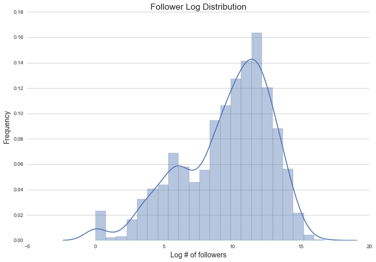


## Exploring relationship between artist/song popularity and playlist popularity:

This is a very unbalanced data set, and thus for much of our EDA we looked only at the **top 25%** of playlists in terms of follower number. The hope here is that this would be more illuminating in highlighting any trends, and would be less bogged down in the high number of playlists that have little to no followers. 


### Average Song Popularity vs. Log Followers


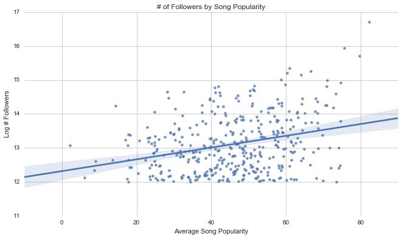


### % Popular Artists in a Playlist vs. Log Followers


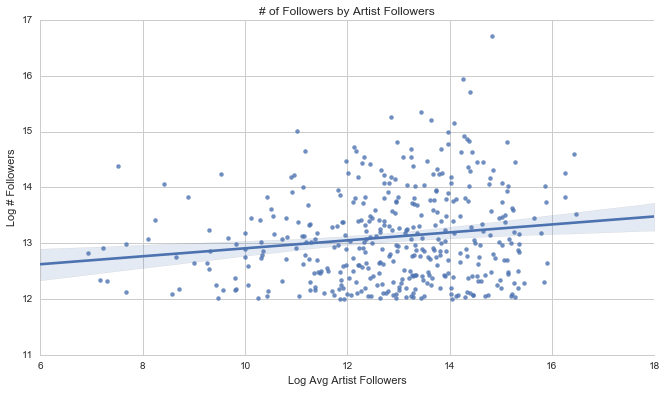


### Average Artist Popularity vs. Log Followers


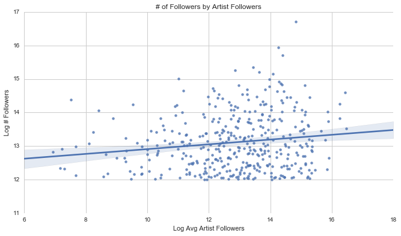


We wanted to explore one of the most logical relationships, the tie between individual song or artist popularity and playlist popularity. Above we see the relationship between average song popularity (the average of the score 1-100 across all songs in the playlist) and number of playlist followers, as well as the average artist popularity and number of followers, for the top 25% of playlists. For both plots, we see a slight positive correlation between average song popularity and playlist success. 

## Exploring Genre Diversity in Playlists

We thought it would be interesting to see if playlists that are uniform in genre, which we defined as being at least **80% composed of a single genre** of music, were more or less popular than genres which seemingly lacked a theme, and were composed of more of a hodgepodge of songs with varying genres.


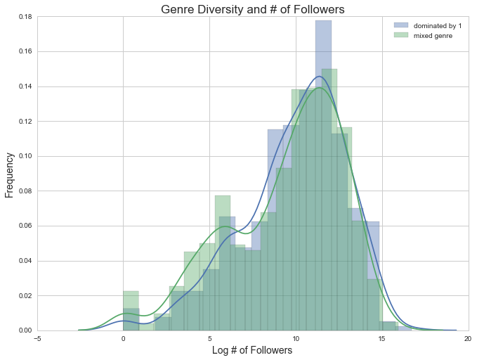


Above we see that there are a lot more playlists with mixed genre, though the spreads of the two look roughly the same. Thus, on average there seems to be no advantage to either a playlist composed entirely of one genre, or consisting of many genres. 

## Heatmap of our Variables


We decided to use a heatmap in order to show how some of our variables were correlated with one another. This heatmap measures correlation between our predictors and our response (log followers), with a positive (red) correlation indicating that there is a direct relationship, and a negative (blue) correlation indicating that there is an inverse relationship.


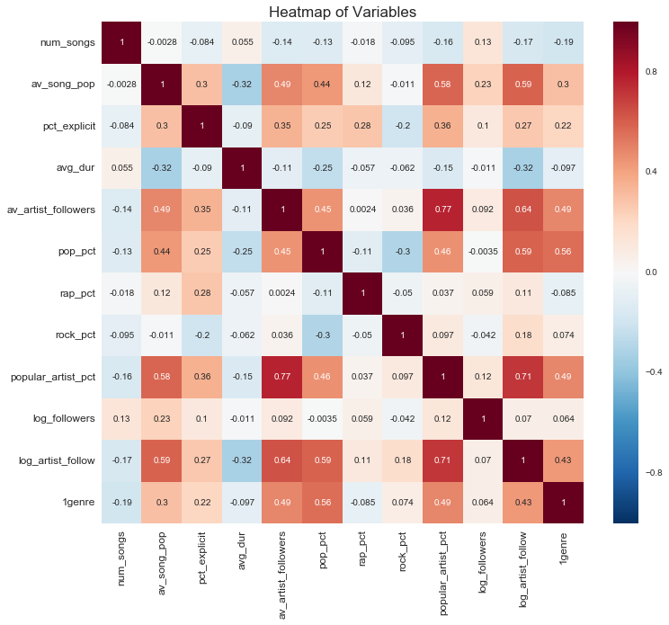


Many of the results below show up as expected. Some are obvious, for instance:
- Average artist followers directly correlates highly with proportion of popular artists in the playlist
- Average song popularity directly correlates well with proportion of pop songs in the playlist

But we also see things that are not immediately as intuitive:
- There is negative correlation between the average duration of songs in a playlist and average song popularity
- There is some positive correlation between the proportion of explicit songs in the playlist and the proportion of pop and rap songs, while there is a weak negative correlation for proportion of rock songs.

With regards to our response variable, we see that the strongest relationships that log(followers) has is with **Average Song Popularity** and **Number of songs**. However these correlations are fairly weak, as one would expect, because there is such a large amount of variation in creating a successful/highly followed playlist.

*Note*: For the sake of simplicity, we only included 3 genre variables, though later in our analysis we end up using more to describe the different genres that playlists have.


## Exploring What is Featured Most Often in Playlists

We wanted to look at most popular tracks, artists, and genres represented across playlists to get a sense of the distribution (i.e. is it fairly evenly spread or dominated by a small minority), and of any outliers that may be particularly indicative of a successful playlist.


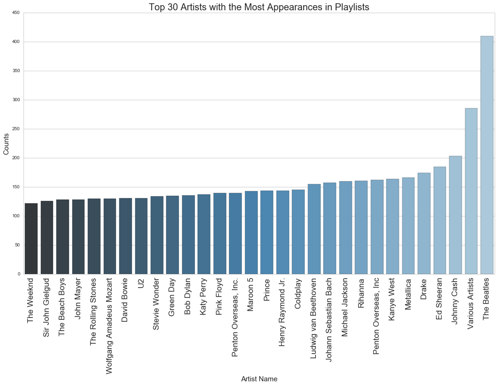


Here, the important trend is that the most popular artists fall into one of three categories. First, there are oldie artists that are timeless and thus remain popular even today (eg. The Beatles, Stevie Wonder, and Michael Jackson). Second, we have trendy artists that are hip with the times (eg. Drake, Rihanna, and Ed Sheeran). Third, there are random artists that don't seem immediately obvious or gibberish (eg. Penton Overseas, Sir John Gielgud, etc.). 

Also important to note is the Spotify generated error that Penton Overseas, Inc. is double recorded here, both with and without a period at the end of the string. We don't expext this to be the case with other artists because of Spotify committing to making searches easy and trademark/ lisencing problems.


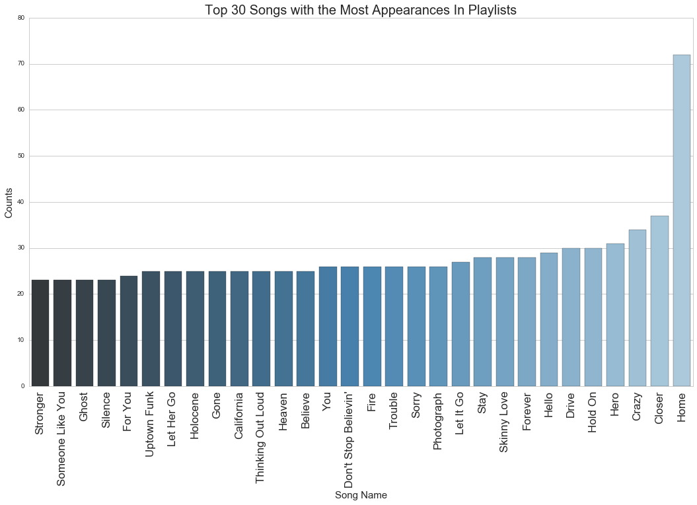


Some interesting things to note here:
- It's hard to distinguish whether these songs refer to a single song by an artist or multiple, since some, like "Home" or "Crazy" are common song titles. It's easier to know what songs are most common with longer, more specific names like "Skinny Love" or "Don't Stop Believin'". 
- Based on the songs we're seeing, it seems like the songs that are most prevalent in playlists tend to be non-explicit and a majority pop/indie.


    ['dance pop', 'pop', 'post-teen pop']


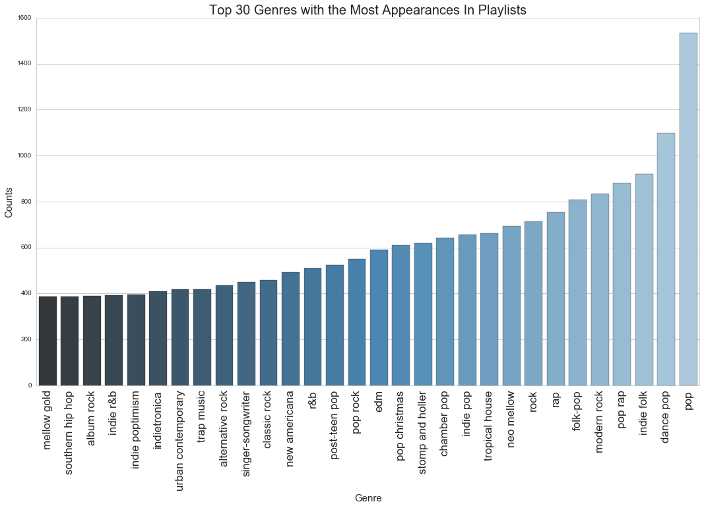


Here, we see that many of the most popular genres include, edm (electronic), pop, and rap music. This makes sense given current popular music tastes in the US. Additionally, we see above that the different between, for example, post-teen pop and pop is likely pretty insignificant. Thus, since songs do not fit neatly into genres, this predictor may be a little bit shaky. There is significant overlap in terms of genre (especially since we are thinking about the artis's genre as being definitive of the song genre, though that may not necessarily be the case. For exampe, Taylor Swift is classified now as pop even though her original music was country).

The bottom line observation here is that data returned from the Spotify API is messy, which is likely to factor heavily into the effectiveness of our model. This is something that we will have to take into consideration when taking future steps.

### Looking at Genre-Specific Playlists and Followers

In the following graphs, we looked at the following 11 genres: Pop, Rock, Rap, Hip-Hop, Country, Metal, Indie Folk, R&B, EDM (Electronic Dance Music), Classical, and Jazz. Additionally, we looked at playlists that were made up mostly of artists that were deemed popular (as having a popularity score over 75). We defined genre-specific playlists (or popular artist-specific playlists) as those that had more than 70% of a single genre or more than 70% of popular artists. We use an indicator of 1 here to signify when playlists fall into this category; otherwise they are assigned a 0. We compare the distribution of followers between these two, for all 12 categories.


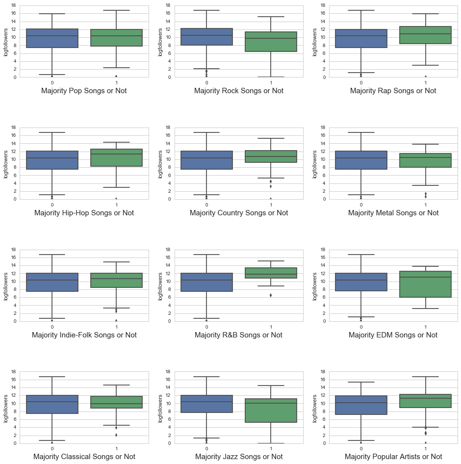


For the most part, we see a smaller spread in the playlists that are genre or popular-specific and those that aren't. One thing to note would be that for almost all 12 categories, the variation in the specific playlists is smaller, which is likely due to there being fewer observations. The most interesting things we see from these graphs is that:
- R&B-specific playlists seem to have significantly more followers; in addition, their spread is much smaller.
- Popular Artist-specific playlists also seem to have more followers on average, though their spread seems to be fairly equal for non pop. artist playlists.
- Rap and Hip-Hop-specific playlists have distributions that may suggest that overall these playlists have slightly more followers than the average non-Rap or Hip-Hop-specific playlist.
