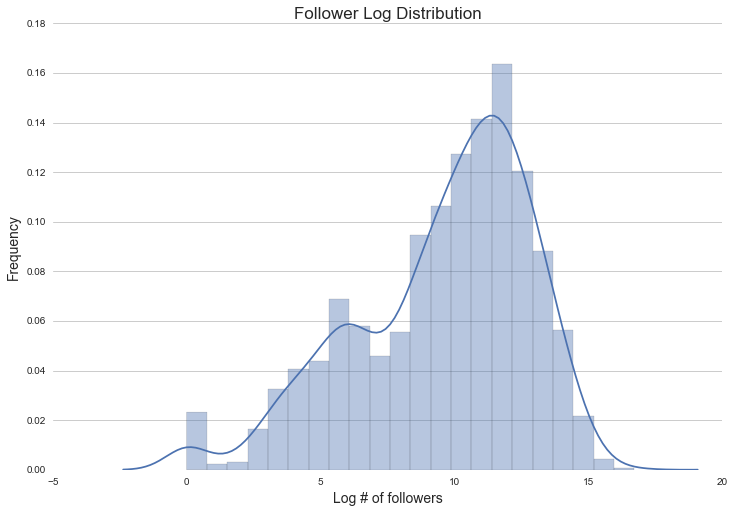
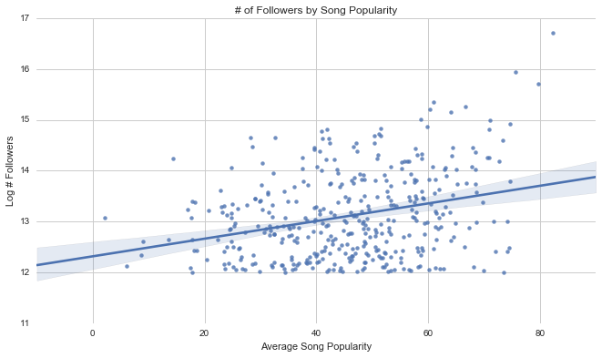
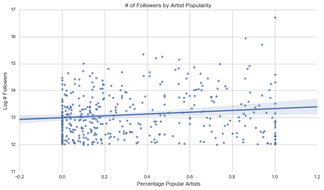
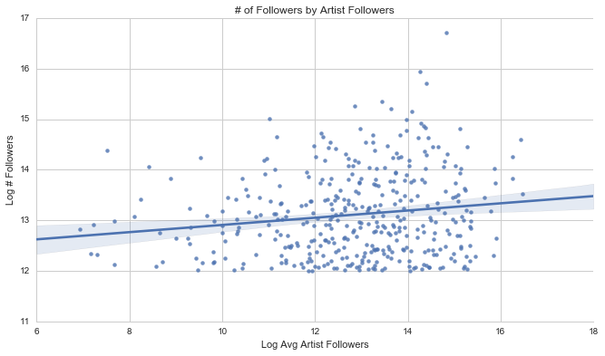
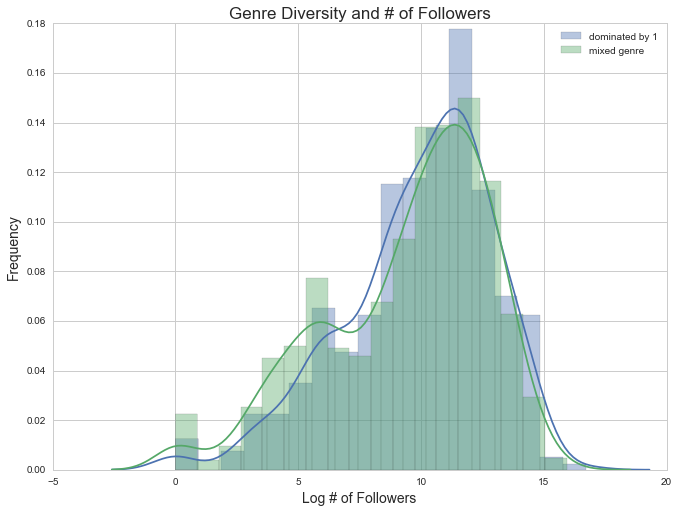
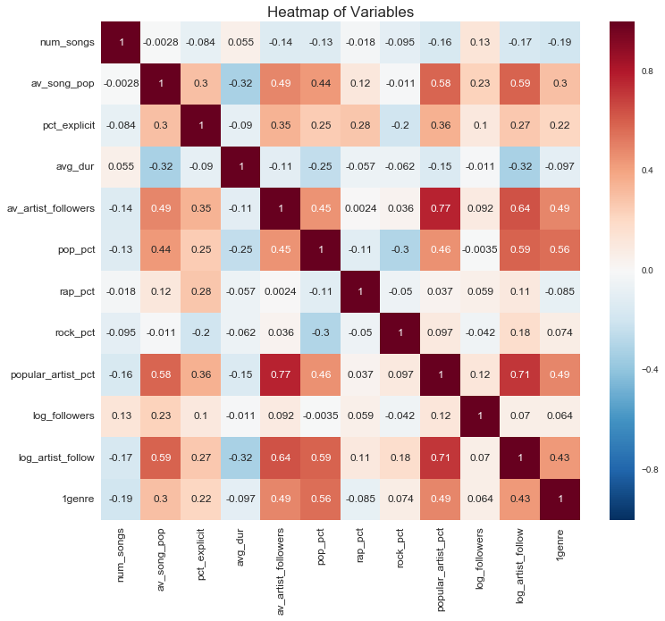
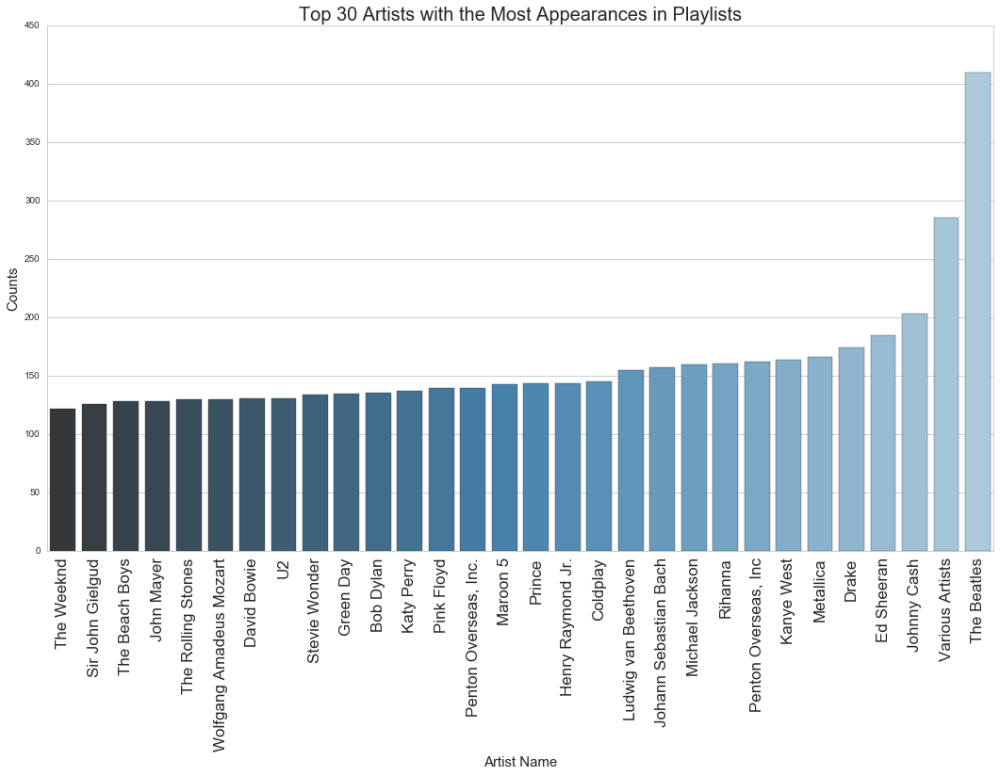
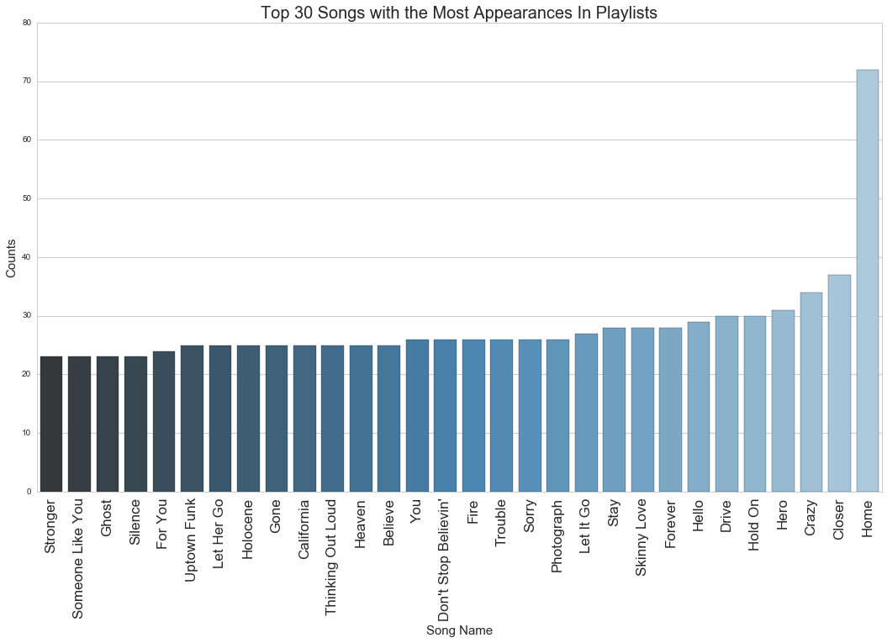
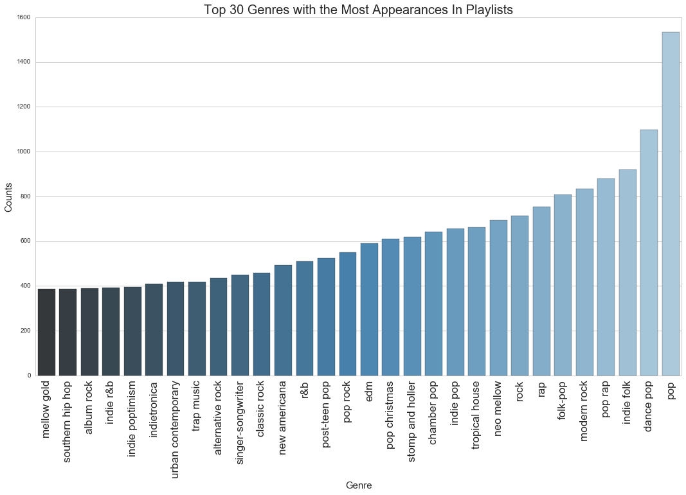

## Contents
{:.no_toc}
*  
{: toc}


**We performed our EDA using data from the Spotify API. The API featured "metadata in JSON format about artists, albums, and tracks directly from the Spotify catalogue".** 


The data used below for our EDA features 1585 playlists that we accessed using the Spotipy package, enabling us to pull data on Spotify's own curated playlists. We analyzed data on these playlists with all of their songs, as well as their artist name, whether they were explicit or not, duration, the artist's popularity (if there were multiple artists we only took the first artist) and number of followers, as well as the genres that the artist is classified under.


<div>
<table border="1" class="dataframe">
  <thead>
    <tr style="text-align: right;">
      <th></th>
      <th>playlist_id</th>
      <th>playlist_name</th>
      <th>followers</th>
      <th>song_name</th>
      <th>number_of_artists</th>
      <th>artist_name</th>
      <th>artist_id</th>
      <th>popularity</th>
      <th>track_number</th>
      <th>explicit</th>
      <th>duration_ms</th>
      <th>available_markets</th>
      <th>delete</th>
      <th>artist_popularity</th>
      <th>artist_followers</th>
      <th>artist_genres</th>
    </tr>
  </thead>
  <tbody>
    <tr>
      <th>0</th>
      <td>37i9dQZF1DXcBWIGoYBM5M</td>
      <td>Today's Top Hits</td>
      <td>18123888.0</td>
      <td>Wolves</td>
      <td>2</td>
      <td>Selena Gomez</td>
      <td>0C8ZW7ezQVs4URX5aX7Kqx</td>
      <td>88</td>
      <td>1</td>
      <td>0</td>
      <td>197993</td>
      <td>['AD', 'AR', 'AT', 'AU', 'BE', 'BG', 'BO', 'BR...</td>
      <td>NaN</td>
      <td>93.0</td>
      <td>6817859.0</td>
      <td>['dance pop', 'pop', 'post-teen pop']</td>
    </tr>
    <tr>
      <th>1</th>
      <td>37i9dQZF1DWXDAhqlN7e6W</td>
      <td>This Is: Max Martin</td>
      <td>15685.0</td>
      <td>Hands To Myself</td>
      <td>1</td>
      <td>Selena Gomez</td>
      <td>0C8ZW7ezQVs4URX5aX7Kqx</td>
      <td>69</td>
      <td>3</td>
      <td>0</td>
      <td>200680</td>
      <td>['AD', 'AR', 'AT', 'AU', 'BE', 'BG', 'BO', 'BR...</td>
      <td>NaN</td>
      <td>93.0</td>
      <td>6817859.0</td>
      <td>['dance pop', 'pop', 'post-teen pop']</td>
    </tr>
    <tr>
      <th>2</th>
      <td>37i9dQZF1DX7Q7o98uPeg1</td>
      <td>Funkst</td>
      <td>397098.0</td>
      <td>Good For You - KASBO Remix</td>
      <td>3</td>
      <td>Selena Gomez</td>
      <td>0C8ZW7ezQVs4URX5aX7Kqx</td>
      <td>35</td>
      <td>3</td>
      <td>0</td>
      <td>221560</td>
      <td>['AD', 'AR', 'AT', 'AU', 'BE', 'BG', 'BO', 'BR...</td>
      <td>NaN</td>
      <td>93.0</td>
      <td>6817859.0</td>
      <td>['dance pop', 'pop', 'post-teen pop']</td>
    </tr>
    <tr>
      <th>3</th>
      <td>37i9dQZF1DX3LyU0mhfqgP</td>
      <td>Out Now</td>
      <td>439685.0</td>
      <td>Wolves</td>
      <td>2</td>
      <td>Selena Gomez</td>
      <td>0C8ZW7ezQVs4URX5aX7Kqx</td>
      <td>88</td>
      <td>1</td>
      <td>0</td>
      <td>197993</td>
      <td>['AD', 'AR', 'AT', 'AU', 'BE', 'BG', 'BO', 'BR...</td>
      <td>NaN</td>
      <td>93.0</td>
      <td>6817859.0</td>
      <td>['dance pop', 'pop', 'post-teen pop']</td>
    </tr>
    <tr>
      <th>4</th>
      <td>37i9dQZF1DX35oM5SPECmN</td>
      <td>HIIT Workout</td>
      <td>712771.0</td>
      <td>Come &amp; Get It</td>
      <td>1</td>
      <td>Selena Gomez</td>
      <td>0C8ZW7ezQVs4URX5aX7Kqx</td>
      <td>56</td>
      <td>1</td>
      <td>0</td>
      <td>231733</td>
      <td>['AD', 'AR', 'AT', 'AU', 'BE', 'BG', 'BO', 'BR...</td>
      <td>NaN</td>
      <td>93.0</td>
      <td>6817859.0</td>
      <td>['dance pop', 'pop', 'post-teen pop']</td>
    </tr>
  </tbody>
</table>
</div>


We appended indicator variables to tell us whether a song in a playlist could be classified as a pop/rap/rock song, as well as if the song was written by a popular artist. We defined a “popular artist” as one ranked by Spotify as above 75 on an artist popularity scale of 1-100 (since this was the third quartile value). 


    Index(['playlist_id', 'playlist_name', 'followers', 'song_name',
           'number_of_artists', 'artist_name', 'artist_id', 'popularity',
           'track_number', 'explicit', 'duration_ms', 'available_markets',
           'delete', 'artist_popularity', 'artist_followers', 'artist_genres',
           'pop_ind', 'rap_ind', 'rock_ind', 'hip_hop_ind', 'popular_artist_ind'],
          dtype='object')


We aggregated the data from individual songs into averages across entire playlists. These conglomerated metrics include the playlist’s average artist followers, percent explicit, number of songs, percent of playlist that is a certain genre (pop, rap, rock, etc), percent popular artists, average song duration, average song popularity (scale of 1-100).


<div>
<table border="1" class="dataframe">
  <thead>
    <tr style="text-align: right;">
      <th></th>
      <th>playlist</th>
      <th>name</th>
      <th>followers</th>
      <th>num_songs</th>
      <th>av_song_pop</th>
      <th>pct_explicit</th>
      <th>avg_dur</th>
      <th>av_artist_followers</th>
      <th>pop_pct</th>
      <th>rap_pct</th>
      <th>rock_pct</th>
      <th>popular_artist_pct</th>
    </tr>
  </thead>
  <tbody>
    <tr>
      <th>0</th>
      <td>37i9dQZF1DXcBWIGoYBM5M</td>
      <td>0       Today's Top Hits
47      Today's Top H...</td>
      <td>1.81239e+07</td>
      <td>50</td>
      <td>82.38</td>
      <td>0.34</td>
      <td>208121</td>
      <td>2.75535e+06</td>
      <td>0.8</td>
      <td>0.06</td>
      <td>0</td>
      <td>1</td>
    </tr>
    <tr>
      <th>1</th>
      <td>37i9dQZF1DWXDAhqlN7e6W</td>
      <td>1        This Is: Max Martin
125      This Is:...</td>
      <td>15685</td>
      <td>44</td>
      <td>55.5227</td>
      <td>0.113636</td>
      <td>220925</td>
      <td>3.99045e+06</td>
      <td>0.977273</td>
      <td>0</td>
      <td>0.0227273</td>
      <td>0.75</td>
    </tr>
    <tr>
      <th>2</th>
      <td>37i9dQZF1DX7Q7o98uPeg1</td>
      <td>2        Funkst
2500     Funkst
2569     Funks...</td>
      <td>397098</td>
      <td>100</td>
      <td>32.87</td>
      <td>0.09</td>
      <td>241358</td>
      <td>319005</td>
      <td>0.12</td>
      <td>0.42</td>
      <td>0.02</td>
      <td>0.08</td>
    </tr>
    <tr>
      <th>3</th>
      <td>37i9dQZF1DX3LyU0mhfqgP</td>
      <td>3        Out Now
48       Out Now
267      Out...</td>
      <td>439685</td>
      <td>55</td>
      <td>71.7273</td>
      <td>0.181818</td>
      <td>207392</td>
      <td>1.02241e+06</td>
      <td>0.654545</td>
      <td>0</td>
      <td>0</td>
      <td>0.6</td>
    </tr>
    <tr>
      <th>4</th>
      <td>37i9dQZF1DX35oM5SPECmN</td>
      <td>4        HIIT Workout
129      HIIT Workout
48...</td>
      <td>712771</td>
      <td>50</td>
      <td>59.06</td>
      <td>0.12</td>
      <td>223608</td>
      <td>3.32207e+06</td>
      <td>0.9</td>
      <td>0</td>
      <td>0.04</td>
      <td>0.62</td>
    </tr>
  </tbody>
</table>
</div>


<div>
<table border="1" class="dataframe">
  <thead>
    <tr style="text-align: right;">
      <th></th>
      <th>followers</th>
      <th>num_songs</th>
      <th>av_song_pop</th>
      <th>pct_explicit</th>
      <th>avg_dur</th>
      <th>av_artist_followers</th>
      <th>pop_pct</th>
      <th>rap_pct</th>
      <th>rock_pct</th>
      <th>popular_artist_pct</th>
      <th>log_followers</th>
      <th>log_artist_follow</th>
    </tr>
  </thead>
  <tbody>
    <tr>
      <th>count</th>
      <td>1.584000e+03</td>
      <td>1584.000000</td>
      <td>1584.000000</td>
      <td>1584.000000</td>
      <td>1.584000e+03</td>
      <td>1.584000e+03</td>
      <td>1584.000000</td>
      <td>1584.000000</td>
      <td>1584.000000</td>
      <td>1584.000000</td>
      <td>1584.000000</td>
      <td>1584.000000</td>
    </tr>
    <tr>
      <th>mean</th>
      <td>2.142093e+05</td>
      <td>52.605429</td>
      <td>38.331537</td>
      <td>0.088401</td>
      <td>2.657999e+05</td>
      <td>9.070557e+05</td>
      <td>0.438389</td>
      <td>0.028073</td>
      <td>0.146948</td>
      <td>0.278765</td>
      <td>9.574142</td>
      <td>12.456636</td>
    </tr>
    <tr>
      <th>std</th>
      <td>6.863399e+05</td>
      <td>25.069536</td>
      <td>15.897419</td>
      <td>0.185671</td>
      <td>1.679411e+05</td>
      <td>1.368342e+06</td>
      <td>0.358942</td>
      <td>0.094440</td>
      <td>0.242333</td>
      <td>0.316079</td>
      <td>3.254485</td>
      <td>2.118953</td>
    </tr>
    <tr>
      <th>min</th>
      <td>0.000000e+00</td>
      <td>5.000000</td>
      <td>0.000000</td>
      <td>0.000000</td>
      <td>3.962875e+04</td>
      <td>9.000000e+00</td>
      <td>0.000000</td>
      <td>0.000000</td>
      <td>0.000000</td>
      <td>0.000000</td>
      <td>0.000000</td>
      <td>2.197225</td>
    </tr>
    <tr>
      <th>25%</th>
      <td>1.746250e+03</td>
      <td>32.000000</td>
      <td>27.724700</td>
      <td>0.000000</td>
      <td>2.146209e+05</td>
      <td>9.689143e+04</td>
      <td>0.040000</td>
      <td>0.000000</td>
      <td>0.000000</td>
      <td>0.010000</td>
      <td>7.465226</td>
      <td>11.481337</td>
    </tr>
    <tr>
      <th>50%</th>
      <td>3.029700e+04</td>
      <td>50.000000</td>
      <td>39.426216</td>
      <td>0.010000</td>
      <td>2.327892e+05</td>
      <td>3.867883e+05</td>
      <td>0.453229</td>
      <td>0.000000</td>
      <td>0.033333</td>
      <td>0.150000</td>
      <td>10.318803</td>
      <td>12.865618</td>
    </tr>
    <tr>
      <th>75%</th>
      <td>1.628768e+05</td>
      <td>66.000000</td>
      <td>49.196341</td>
      <td>0.084105</td>
      <td>2.581028e+05</td>
      <td>1.116790e+06</td>
      <td>0.763927</td>
      <td>0.000000</td>
      <td>0.180000</td>
      <td>0.460000</td>
      <td>12.000749</td>
      <td>13.925968</td>
    </tr>
    <tr>
      <th>max</th>
      <td>1.812389e+07</td>
      <td>100.000000</td>
      <td>82.380000</td>
      <td>1.000000</td>
      <td>2.507284e+06</td>
      <td>1.424941e+07</td>
      <td>1.000000</td>
      <td>1.000000</td>
      <td>1.000000</td>
      <td>1.000000</td>
      <td>16.712741</td>
      <td>16.472226</td>
    </tr>
  </tbody>
</table>
</div>


## Exploring the distribution of followers





### Exploring relationship between artist/song popularity and playlist popularity:

This is a very unbalanced data set, and thus for much of our EDA we looked only at the **top 25%** of playlists in terms of follower number. The hope here is that this would be more illuminating in highlighting any trends, and would be less bogged down in the high number of playlists that have little to no followers. 


### Average Song Popularity vs. Log Followers





### % Popular Artists in a Playlist vs. Log Followers





### Average Artist Popularity vs. Log Followers





We wanted to explore one of the most logical relationships, the tie between individual song or artist popularity and playlist popularity. Above we see the relationship between average song popularity (the average of the score 1-100 across all songs in the playlist) and number of playlist followers, as well as the average artist popularity and number of followers, for the top 25% of playlists. For both plots, we see a slight positive correlation between average song popularity and playlist success. 

### Exploring Genre Diversity in Playlists

We thought it would be interesting to see if playlists that are uniform in genre, which we defined as being at least **80% composed of a single genre** of music, were more or less popular than genres which seemingly lacked a theme, and were composed of more of a hodgepodge of songs with varying genres. Above we see that there are a lot more playlists with mixed genre, though the spreads of the two look roughly the same. Thus, on average there seems to be no advantage to either a playlist composed entirely of one genre, or consisting of many genres. 





### Heatmap of our Variables


We decided to use a heatmap in order to show how some of our variables were correlated with one another. Many of the results below show up as expected. Some are obvious, for instance:
- Average artist followers directly correlates highly with proportion of popular artists in the playlist
- Average song popularity directly correlates well with proportion of pop songs in the playlist

But we also see things that are not immediately as intuitive:
- There is negative correlation between the average duration of songs in a playlist and average song popularity
- There is some positive correlation between the proportion of explicit songs in the playlist and the proportion of pop and rap songs, while there is a weak negative correlation for proportion of rock songs.

With regards to our response variable, we see that the strongest relationships that log(followers) has is with **Average Song Popularity** and **Number of songs**. However these correlations are fairly weak, as one would expect, because there is such a large amount of variation in creating a successful/highly followed playlist.

*Note*: For the sake of simplicity, we only included 3 genre variables, though later in our analysis we end up using more to describe the different genres that playlists have.





### Exploring what is featured most often in playlists

We wanted to look at most popular tracks, artists, and genres represented across playlists to get a sense of the distribution (i.e. is it fairly evenly spread or dominated by a small minority), and of any outliers that may be particularly indicative of a successful playlist.





Here, the important trend is that the most popular artists fall into one of three categories. First, there are oldie artists that are timeless and thus remain popular even today (eg. The Beatles, Stevie Wonder, and Michael Jackson). Second, we have trendy artists that are hip with the times (eg. Drake, Rihanna, and Ed Sheeran). Third, there are random artists that don't seem immediately obvious or gibberish (eg. Penton Overseas, Sir John Gielgud, etc.). 

Also important to note is the Spotify generated error that Penton Overseas, Inc. is double recorded here, both with and without a period at the end of the string. We don't expext this to be the case with other artists because of Spotify committing to making searches easy and trademark/ lisencing problems.





Some interesting things to note here:
- It's hard to distinguish whether these songs refer to a single song by an artist or multiple, since some, like "Home" or "Crazy" are common song titles. It's easier to know what songs are most common with longer, more specific names like "Skinny Love" or "Don't Stop Believin'". 
- Based on the songs we're seeing, it seems like the songs that are most prevalent in playlists tend to be non-explicit and a majority pop/indie.


    ['dance pop', ' pop', ' post-teen pop']





Here, we see that many of the most popular genres include, edm (electronic), pop, and rap music. This makes sense given current popular music tastes in the US. Additionally, we see above that the different between, for example, post-teen pop and pop is likely pretty insignificant. Thus, since songs do not fit neatly into genres, this predictor may be a little bit shaky. There is significant overlap in terms of genre (especially since we are thinking about the artis's genre as being definitive of the song genre, though that may not necessarily be the case. For exampe, Taylor Swift is classified now as pop even though her original music was country).

The bottom line observation here is that data returned from the Spotify API is messy, which is likely to factor heavily into the effectiveness of our model. This is something that we will have to take into consideration when taking future steps.


```python

```

