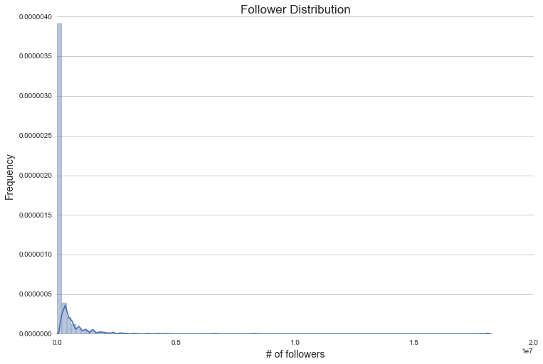
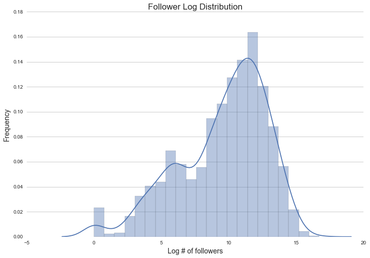
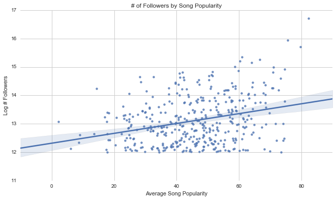
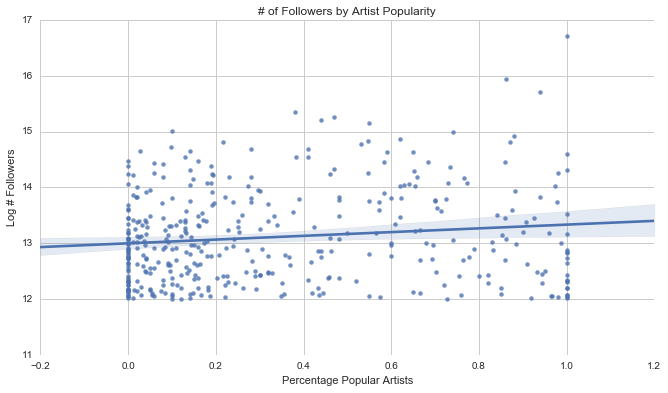
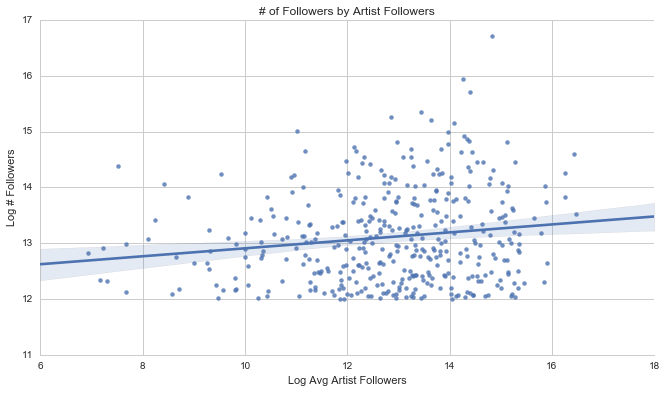
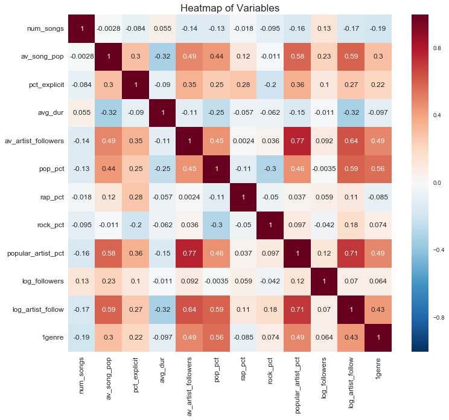

## Contents
{:.no_toc}
*  
{: toc}

**CS109A Final Project**<br/>
**Group 12**<br/>
**EDA Page**<br/>


```python
import numpy as np
import pandas as pd
import matplotlib
import matplotlib.pyplot as plt
import seaborn as sns; sns.set(color_codes=True)
sns.set(style="whitegrid")
import warnings
warnings.filterwarnings('ignore')
%matplotlib inline
```


**We performed our EDA using data from the Spotify API. The API featured "metadata in JSON format about artists, albums, and tracks directly from the Spotify catalogue".** 


The data used below for our EDA features 1585 playlists that we accessed using the Spotipy package, enabling us to pull data on Spotify's own curated playlists. We analyzed data on these playlists with all of their songs, as well as their artist name, whether they were explicit or not, duration, the artist's popularity (if there were multiple artists we only took the first artist) and number of followers, as well as the genres that the artist is classified under.


```python
df = pd.read_csv('total_info.csv', encoding = 'latin-1')
```


```python
df.head()
```


<div>
<table border="1" class="dataframe">
  <thead>
    <tr style="text-align: right;">
      <th></th>
      <th>playlist_id</th>
      <th>playlist_name</th>
      <th>followers</th>
      <th>song_name</th>
      <th>number_of_artists</th>
      <th>artist_name</th>
      <th>artist_id</th>
      <th>popularity</th>
      <th>track_number</th>
      <th>explicit</th>
      <th>duration_ms</th>
      <th>available_markets</th>
      <th>delete</th>
      <th>artist_popularity</th>
      <th>artist_followers</th>
      <th>artist_genres</th>
    </tr>
  </thead>
  <tbody>
    <tr>
      <th>0</th>
      <td>37i9dQZF1DXcBWIGoYBM5M</td>
      <td>Today's Top Hits</td>
      <td>18123888.0</td>
      <td>Wolves</td>
      <td>2</td>
      <td>Selena Gomez</td>
      <td>0C8ZW7ezQVs4URX5aX7Kqx</td>
      <td>88</td>
      <td>1</td>
      <td>0</td>
      <td>197993</td>
      <td>['AD', 'AR', 'AT', 'AU', 'BE', 'BG', 'BO', 'BR...</td>
      <td>NaN</td>
      <td>93.0</td>
      <td>6817859.0</td>
      <td>['dance pop', 'pop', 'post-teen pop']</td>
    </tr>
    <tr>
      <th>1</th>
      <td>37i9dQZF1DWXDAhqlN7e6W</td>
      <td>This Is: Max Martin</td>
      <td>15685.0</td>
      <td>Hands To Myself</td>
      <td>1</td>
      <td>Selena Gomez</td>
      <td>0C8ZW7ezQVs4URX5aX7Kqx</td>
      <td>69</td>
      <td>3</td>
      <td>0</td>
      <td>200680</td>
      <td>['AD', 'AR', 'AT', 'AU', 'BE', 'BG', 'BO', 'BR...</td>
      <td>NaN</td>
      <td>93.0</td>
      <td>6817859.0</td>
      <td>['dance pop', 'pop', 'post-teen pop']</td>
    </tr>
    <tr>
      <th>2</th>
      <td>37i9dQZF1DX7Q7o98uPeg1</td>
      <td>Funkst</td>
      <td>397098.0</td>
      <td>Good For You - KASBO Remix</td>
      <td>3</td>
      <td>Selena Gomez</td>
      <td>0C8ZW7ezQVs4URX5aX7Kqx</td>
      <td>35</td>
      <td>3</td>
      <td>0</td>
      <td>221560</td>
      <td>['AD', 'AR', 'AT', 'AU', 'BE', 'BG', 'BO', 'BR...</td>
      <td>NaN</td>
      <td>93.0</td>
      <td>6817859.0</td>
      <td>['dance pop', 'pop', 'post-teen pop']</td>
    </tr>
    <tr>
      <th>3</th>
      <td>37i9dQZF1DX3LyU0mhfqgP</td>
      <td>Out Now</td>
      <td>439685.0</td>
      <td>Wolves</td>
      <td>2</td>
      <td>Selena Gomez</td>
      <td>0C8ZW7ezQVs4URX5aX7Kqx</td>
      <td>88</td>
      <td>1</td>
      <td>0</td>
      <td>197993</td>
      <td>['AD', 'AR', 'AT', 'AU', 'BE', 'BG', 'BO', 'BR...</td>
      <td>NaN</td>
      <td>93.0</td>
      <td>6817859.0</td>
      <td>['dance pop', 'pop', 'post-teen pop']</td>
    </tr>
    <tr>
      <th>4</th>
      <td>37i9dQZF1DX35oM5SPECmN</td>
      <td>HIIT Workout</td>
      <td>712771.0</td>
      <td>Come &amp; Get It</td>
      <td>1</td>
      <td>Selena Gomez</td>
      <td>0C8ZW7ezQVs4URX5aX7Kqx</td>
      <td>56</td>
      <td>1</td>
      <td>0</td>
      <td>231733</td>
      <td>['AD', 'AR', 'AT', 'AU', 'BE', 'BG', 'BO', 'BR...</td>
      <td>NaN</td>
      <td>93.0</td>
      <td>6817859.0</td>
      <td>['dance pop', 'pop', 'post-teen pop']</td>
    </tr>
  </tbody>
</table>
</div>


We appended indicator variables to tell us whether a song in a playlist could be classified as a pop/rap/rock song, as well as if the song was written by a popular artist. We defined a “popular artist” as one ranked by Spotify as above 75 on an artist popularity scale of 1-100 (since this was the third quartile value). 


```python
df['popular_artist_ind'] = (df['artist_popularity'] >= 75)*1
df.columns
```


    Index(['playlist_id', 'playlist_name', 'followers', 'song_name',
           'number_of_artists', 'artist_name', 'artist_id', 'popularity',
           'track_number', 'explicit', 'duration_ms', 'available_markets',
           'delete', 'artist_popularity', 'artist_followers', 'artist_genres',
           'pop_ind', 'rap_ind', 'rock_ind', 'hip_hop_ind', 'popular_artist_ind'],
          dtype='object')


We aggregated the data from individual songs into averages across entire playlists. These conglomerated metrics include the playlist’s average artist followers, percent explicit, number of songs, percent of playlist that is a certain genre (pop, rap, rock, etc), percent popular artists, average song duration, average song popularity (scale of 1-100).


<div>
<table border="1" class="dataframe">
  <thead>
    <tr style="text-align: right;">
      <th></th>
      <th>playlist</th>
      <th>name</th>
      <th>followers</th>
      <th>num_songs</th>
      <th>av_song_pop</th>
      <th>pct_explicit</th>
      <th>avg_dur</th>
      <th>av_artist_followers</th>
      <th>pop_pct</th>
      <th>rap_pct</th>
      <th>rock_pct</th>
      <th>popular_artist_pct</th>
    </tr>
  </thead>
  <tbody>
    <tr>
      <th>0</th>
      <td>37i9dQZF1DXcBWIGoYBM5M</td>
      <td>0       Today's Top Hits
47      Today's Top H...</td>
      <td>1.81239e+07</td>
      <td>50</td>
      <td>82.38</td>
      <td>0.34</td>
      <td>208121</td>
      <td>2.75535e+06</td>
      <td>0.8</td>
      <td>0.06</td>
      <td>0</td>
      <td>1</td>
    </tr>
    <tr>
      <th>1</th>
      <td>37i9dQZF1DWXDAhqlN7e6W</td>
      <td>1        This Is: Max Martin
125      This Is:...</td>
      <td>15685</td>
      <td>44</td>
      <td>55.5227</td>
      <td>0.113636</td>
      <td>220925</td>
      <td>3.99045e+06</td>
      <td>0.977273</td>
      <td>0</td>
      <td>0.0227273</td>
      <td>0.75</td>
    </tr>
    <tr>
      <th>2</th>
      <td>37i9dQZF1DX7Q7o98uPeg1</td>
      <td>2        Funkst
2500     Funkst
2569     Funks...</td>
      <td>397098</td>
      <td>100</td>
      <td>32.87</td>
      <td>0.09</td>
      <td>241358</td>
      <td>319005</td>
      <td>0.12</td>
      <td>0.42</td>
      <td>0.02</td>
      <td>0.08</td>
    </tr>
    <tr>
      <th>3</th>
      <td>37i9dQZF1DX3LyU0mhfqgP</td>
      <td>3        Out Now
48       Out Now
267      Out...</td>
      <td>439685</td>
      <td>55</td>
      <td>71.7273</td>
      <td>0.181818</td>
      <td>207392</td>
      <td>1.02241e+06</td>
      <td>0.654545</td>
      <td>0</td>
      <td>0</td>
      <td>0.6</td>
    </tr>
    <tr>
      <th>4</th>
      <td>37i9dQZF1DX35oM5SPECmN</td>
      <td>4        HIIT Workout
129      HIIT Workout
48...</td>
      <td>712771</td>
      <td>50</td>
      <td>59.06</td>
      <td>0.12</td>
      <td>223608</td>
      <td>3.32207e+06</td>
      <td>0.9</td>
      <td>0</td>
      <td>0.04</td>
      <td>0.62</td>
    </tr>
  </tbody>
</table>
</div>


```python
eda_frame.drop(['playlist', 'name'], axis = 1).describe()
```


<div>
<table border="1" class="dataframe">
  <thead>
    <tr style="text-align: right;">
      <th></th>
      <th>followers</th>
      <th>num_songs</th>
      <th>av_song_pop</th>
      <th>pct_explicit</th>
      <th>avg_dur</th>
      <th>av_artist_followers</th>
      <th>pop_pct</th>
      <th>rap_pct</th>
      <th>rock_pct</th>
      <th>popular_artist_pct</th>
      <th>log_followers</th>
      <th>log_artist_follow</th>
    </tr>
  </thead>
  <tbody>
    <tr>
      <th>count</th>
      <td>1.584000e+03</td>
      <td>1584.000000</td>
      <td>1584.000000</td>
      <td>1584.000000</td>
      <td>1.584000e+03</td>
      <td>1.584000e+03</td>
      <td>1584.000000</td>
      <td>1584.000000</td>
      <td>1584.000000</td>
      <td>1584.000000</td>
      <td>1584.000000</td>
      <td>1584.000000</td>
    </tr>
    <tr>
      <th>mean</th>
      <td>2.142093e+05</td>
      <td>52.605429</td>
      <td>38.331537</td>
      <td>0.088401</td>
      <td>2.657999e+05</td>
      <td>9.070557e+05</td>
      <td>0.438389</td>
      <td>0.028073</td>
      <td>0.146948</td>
      <td>0.278765</td>
      <td>9.574142</td>
      <td>12.456636</td>
    </tr>
    <tr>
      <th>std</th>
      <td>6.863399e+05</td>
      <td>25.069536</td>
      <td>15.897419</td>
      <td>0.185671</td>
      <td>1.679411e+05</td>
      <td>1.368342e+06</td>
      <td>0.358942</td>
      <td>0.094440</td>
      <td>0.242333</td>
      <td>0.316079</td>
      <td>3.254485</td>
      <td>2.118953</td>
    </tr>
    <tr>
      <th>min</th>
      <td>0.000000e+00</td>
      <td>5.000000</td>
      <td>0.000000</td>
      <td>0.000000</td>
      <td>3.962875e+04</td>
      <td>9.000000e+00</td>
      <td>0.000000</td>
      <td>0.000000</td>
      <td>0.000000</td>
      <td>0.000000</td>
      <td>0.000000</td>
      <td>2.197225</td>
    </tr>
    <tr>
      <th>25%</th>
      <td>1.746250e+03</td>
      <td>32.000000</td>
      <td>27.724700</td>
      <td>0.000000</td>
      <td>2.146209e+05</td>
      <td>9.689143e+04</td>
      <td>0.040000</td>
      <td>0.000000</td>
      <td>0.000000</td>
      <td>0.010000</td>
      <td>7.465226</td>
      <td>11.481337</td>
    </tr>
    <tr>
      <th>50%</th>
      <td>3.029700e+04</td>
      <td>50.000000</td>
      <td>39.426216</td>
      <td>0.010000</td>
      <td>2.327892e+05</td>
      <td>3.867883e+05</td>
      <td>0.453229</td>
      <td>0.000000</td>
      <td>0.033333</td>
      <td>0.150000</td>
      <td>10.318803</td>
      <td>12.865618</td>
    </tr>
    <tr>
      <th>75%</th>
      <td>1.628768e+05</td>
      <td>66.000000</td>
      <td>49.196341</td>
      <td>0.084105</td>
      <td>2.581028e+05</td>
      <td>1.116790e+06</td>
      <td>0.763927</td>
      <td>0.000000</td>
      <td>0.180000</td>
      <td>0.460000</td>
      <td>12.000749</td>
      <td>13.925968</td>
    </tr>
    <tr>
      <th>max</th>
      <td>1.812389e+07</td>
      <td>100.000000</td>
      <td>82.380000</td>
      <td>1.000000</td>
      <td>2.507284e+06</td>
      <td>1.424941e+07</td>
      <td>1.000000</td>
      <td>1.000000</td>
      <td>1.000000</td>
      <td>1.000000</td>
      <td>16.712741</td>
      <td>16.472226</td>
    </tr>
  </tbody>
</table>
</div>


## Exploring the distribution of followers





```python
plt.figure(figsize = (12,8))
sns.distplot(eda_frame['log_followers']);
plt.title('Follower Log Distribution', size = 17)
plt.xlabel("Log # of followers", size = 14);
plt.ylabel("Frequency", size = 14)
sns.despine(bottom=True, left=True)
plt.grid(axis = 'x', color ='white', linestyle='-')
ax = plt.gca()
ax.tick_params(axis='both', which='both',length=0);
```





### Exploring relationship between artist/song popularity and playlist popularity:

This is a very unbalanced data set, and thus for much of our EDA we looked only at the **top 25%** of playlists in terms of follower number. The hope here is that this would be more illuminating in highlighting any trends, and would be less bogged down in the high number of playlists that have little to no followers. 


### Average Song Popularity vs. Log Followers


```python
plt.figure(figsize = (11,6))
sns.regplot(np.asarray(pop_top), np.asarray(log_followers_top), marker = 'o', color = 'b')
sns.despine(bottom=True, left=True)
plt.xlabel("Average Song Popularity");
plt.ylabel("Log # Followers")
plt.title("# of Followers by Song Popularity")
plt.show()
```





### % Popular Artists in a Playlist vs. Log Followers


```python
plt.figure(figsize = (11,6))
sns.regplot(top_sorted['popular_artist_pct'], np.asarray(log_followers_top), marker = 'o', color = 'b')
sns.despine(bottom=True, left=True)
plt.xlabel("Percentage Popular Artists");
plt.ylabel("Log # Followers")
plt.title("# of Followers by Artist Popularity")
plt.show()
```





### Average Artist Popularity vs. Log Followers


```python
plt.figure(figsize = (11,6))
sns.regplot(top_sorted['log_artist_follow'], np.asarray(log_followers_top), marker = '', color = 'b')
sns.despine(bottom=True, left=True)
plt.xlabel("Log Avg Artist Followers");
plt.ylabel("Log # Followers")
plt.title("# of Followers by Artist Followers")
plt.show()
```





### Exploring Genre Diversity in Playlists

We thought it would be interesting to see if playlists that are uniform in genre, which we defined as being at least **80% composed of a single genre** of music, were more or less popular than genres which seemingly lacked a theme, and were composed of more of a hodgepodge of songs with varying genres. Above we see that there are a lot more playlists with mixed genre, though the spreads of the two look roughly the same. Thus, on average there seems to be no advantage to either a playlist composed entirely of one genre, or consisting of many genres. 


```python
eda_frame['1genre'] = np.where((eda_frame['pop_pct']>=.8)|(eda_frame['rap_pct']>=.8)|(eda_frame['rock_pct']>=.8), 1, 0)
mixed_genre = eda_frame.loc[eda_frame['1genre'] == 0]
one_genre = eda_frame.loc[eda_frame['1genre'] == 1]
```


```python
plt.figure(figsize = (11,8))
sns.distplot(one_genre['log_followers'], label='dominated by 1')
sns.distplot(mixed_genre['log_followers'], label='mixed genre')
plt.legend(loc='upper right')
plt.title('Genre Diversity and # of Followers', size = 17)
plt.ylabel('Frequency', size = 14)
plt.xlabel('Log # of Followers', size = 14)
plt.show()
```


### Heatmap of our Variables


```python
eda_train = eda_frame.drop(['playlist','name','followers'], axis = 1)
train_corr_matrix = pd.DataFrame(np.corrcoef(eda_train.T))
train_corr_matrix.columns = eda_train.columns
train_corr_matrix.index = eda_train.columns
```


```python
plt.figure(figsize = (12,10))
sns.heatmap(train_corr_matrix,annot=True)
plt.title('Heatmap of Variables', size = 17)
plt.xticks(rotation=90, size = 12) 
plt.yticks(rotation=0, size = 12) 
plt.show()
```





```python
artist_counts = df.groupby('artist_name', as_index=False)['count'].count().sort_values('count', ascending=False)
artist_counts = artist_counts.head(30)
artist_counts = artist_counts.sort_values('count')
plt.figure(figsize = (18,10))
sns.barplot(artist_counts['artist_name'], artist_counts['count'], palette="Blues_d")
plt.xticks(rotation=90, size = 17)
plt.title('Top 30 Artists with the Most Appearances in Playlists', size = 20)
plt.xlabel('Artist Name', size = 15)
plt.ylabel('Counts', size = 15)
plt.show()
```

