## Our Modeling Journey

Our journey in model creation had a variety of different phases as we iterated through the process of running into roadblocks and circling back to try a different method or approach. Looking at an overview of what that actually meant for us we can briefly trace the outline of our steps and then walk through it.

1. Initially, we ran various regressions (linear and regularization-based) on approximately 70 predictor variables. Despite multiple efforts we could not find any model that performed well.

2. Adjusting for this, we went back to our data and bolstered it with additional indicators, interaction terms, and unique predictors we intuitively thought were useful. Running the same models on this data, we still had poor performance (even on our best cross validated Ridge Regression model).

3. Moving away from regression, we decided to switch our focus to classification instead. We defined a success as being known as a 'popular' playlist above our follower threshold and undertook numerous classification models. Ultimately, a Decision Tree model proved to be the best model for us throughout the entire journey. 

4. Now that we are able to tell whether or not a playlist is successful, we tried to create a regression model that would predict just how successful it would be. This intuition made sense because there were so many garbage playlists (eg. Learn to Speak Swedish, etc.). Thinking our data was still being negatively effected by the skew of playlist followers, we decided to only look at the popular playlists that we ultimately are seeking to generate. Using our new bolstered dataset on this subset, we saw mildly improved performance, but nothing substantial enough to gain incredible insights. 

Thus, at the end, we are able to predict, with some accuracy, whether or not a playlist will be successful or not. Once we predict whether or not it is successful, we can predict how successful it will be (using a relatively unreliable model). You see our workflow below.


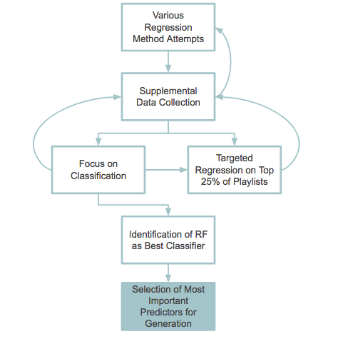


## Model A: Regressing on the Full Dataset

### Overview

We start with OLS multiple regression not because we think that simple linear regression will be a particularly good fit for the data. There is no reason to believe that the assumptions of linear regression would be upheld, or that the predictor variables we have access to will be highly enough correlated with number of playlist followers to give us any sort of successful prediction. However, we use this as our first model just for completion, and to affirm these assumptions that the OLS multiple linear regression is in fact a poor predictive model for number of playlist followers. 

To attempt at improving this, we try various methods such as Ridge and Lasso regressions, as well as backwise stepwisse variable selection. The process is detailed below:

### Linear Regression

One of the goals of our project was to be able to predict the number of followers of a playlist, given a number of songs and their artists. Our first, and simplest predictive model was the Ordinary Least-Squares Multiple Linear Regression Model, which aims to minimize the error produced by a linear function of our predictors. In this case, error is defined by taking the mean of our squared residuals (the actual number of followers - our predicted number). This linear function of our predictors provides us with a simple equation relating our predictors, such as average artist popularity or song duration, to our response variable, the logged number of followers of a playlist.

The benefit of this simple model is that it’s highly interpretable and easy to understand. However, due to the simplicity of the model, there are definitely assumptions that we must account for.
1. Normality: our residuals should be normally distributed. We check this below using a residual vs. fitted plot.
2. Equal Variance: We should have the same variance with each observation; we can also check this below with the residual plot below.
3. Linearity: Our predictors should have a linear relationship with our response; we can observe whether this is violated by checking to see if there are any patterns or any curvature in the residual plot below. Additionally, we saw some of these relationships directly in our EDA. 
4. Independence: Our predictors should be linearly independent, if not, there is multicollinearity in our model. We can account for this by removing predictors that are highly correlated.


<div>
<style>
    .dataframe thead tr:only-child th {
        text-align: right;
    }

    .dataframe thead th {
        text-align: left;
    }

    .dataframe tbody tr th {
        vertical-align: top;
    }
</style>
<table border="1" class="dataframe">
  <thead>
    <tr style="text-align: right;">
      <th></th>
      <th>playlist</th>
      <th>name</th>
      <th>followers</th>
      <th>num_songs</th>
      <th>av_song_pop</th>
      <th>pct_explicit</th>
      <th>avg_dur</th>
      <th>av_artist_followers</th>
      <th>pop_pct</th>
      <th>rap_pct</th>
      <th>...</th>
      <th>Post Malone*rap_pct</th>
      <th>Post Malone*rock_pct</th>
      <th>Post Malone*hip_hop_pct</th>
      <th>Post Malone*country_pct</th>
      <th>Post Malone*metal_pct</th>
      <th>Post Malone*indie_folk_pct</th>
      <th>Post Malone*rnb_pct</th>
      <th>Post Malone*edm_pct</th>
      <th>Post Malone*classical_pct</th>
      <th>Post Malone*jazz_pct</th>
    </tr>
  </thead>
  <tbody>
    <tr>
      <th>0</th>
      <td>37i9dQZF1DXcBWIGoYBM5M</td>
      <td>Today's Top Hits</td>
      <td>16.712741</td>
      <td>-0.095155</td>
      <td>2.767125</td>
      <td>1.329673</td>
      <td>-0.352106</td>
      <td>1.131506</td>
      <td>0.999423</td>
      <td>0.889318</td>
      <td>...</td>
      <td>0.36</td>
      <td>0.00</td>
      <td>0.12</td>
      <td>0.0</td>
      <td>0.0</td>
      <td>0.08</td>
      <td>0.02</td>
      <td>0.22</td>
      <td>0.0</td>
      <td>0.0</td>
    </tr>
    <tr>
      <th>1</th>
      <td>37i9dQZF1DX3LyU0mhfqgP</td>
      <td>Out Now</td>
      <td>12.993814</td>
      <td>0.104091</td>
      <td>2.094954</td>
      <td>0.493535</td>
      <td>-0.356516</td>
      <td>0.654250</td>
      <td>0.596919</td>
      <td>-0.250860</td>
      <td>...</td>
      <td>0.00</td>
      <td>0.00</td>
      <td>0.00</td>
      <td>0.0</td>
      <td>0.0</td>
      <td>0.00</td>
      <td>0.00</td>
      <td>0.00</td>
      <td>0.0</td>
      <td>0.0</td>
    </tr>
    <tr>
      <th>2</th>
      <td>37i9dQZF1DX7Axsg3uaDZb</td>
      <td>Top Tracks of 2016 - USA</td>
      <td>8.558527</td>
      <td>1.897301</td>
      <td>1.931070</td>
      <td>1.911124</td>
      <td>-0.291292</td>
      <td>1.401707</td>
      <td>1.386834</td>
      <td>1.246525</td>
      <td>...</td>
      <td>0.45</td>
      <td>0.07</td>
      <td>0.25</td>
      <td>0.0</td>
      <td>0.0</td>
      <td>0.08</td>
      <td>0.06</td>
      <td>0.19</td>
      <td>0.0</td>
      <td>0.0</td>
    </tr>
    <tr>
      <th>3</th>
      <td>37i9dQZF1DWWoCDtOBjhpE</td>
      <td>Top Female Artists of 2016 - USA</td>
      <td>0.000000</td>
      <td>-1.290629</td>
      <td>1.708333</td>
      <td>0.589643</td>
      <td>-0.230856</td>
      <td>1.427494</td>
      <td>1.552867</td>
      <td>0.055833</td>
      <td>...</td>
      <td>0.00</td>
      <td>0.00</td>
      <td>0.00</td>
      <td>0.0</td>
      <td>0.0</td>
      <td>0.00</td>
      <td>0.00</td>
      <td>0.00</td>
      <td>0.0</td>
      <td>0.0</td>
    </tr>
    <tr>
      <th>4</th>
      <td>7qLIVhpCFAiX1Teqf3L6Y4</td>
      <td>Happy Birthday Cheryl!</td>
      <td>5.332719</td>
      <td>-0.892138</td>
      <td>-0.386537</td>
      <td>-0.467542</td>
      <td>-0.284179</td>
      <td>0.829675</td>
      <td>1.091664</td>
      <td>0.254282</td>
      <td>...</td>
      <td>0.00</td>
      <td>0.00</td>
      <td>0.00</td>
      <td>0.0</td>
      <td>0.0</td>
      <td>0.00</td>
      <td>0.00</td>
      <td>0.00</td>
      <td>0.0</td>
      <td>0.0</td>
    </tr>
  </tbody>
</table>
<p>5 rows × 513 columns</p>
</div>


We initially ran was an ordinary least squares regression using all predictors. This resulted in severe overfitting because of the abundance of predictors we had when compared to the actual number of playlists that we were trying to predict from. We know that we're overfitting the data because all of our training set $R^2$ values are incredibly high around 0.9, but the test and cross validated $R^2$ values were either 0 or even negative.


    Full Model CV R^2:  -6.84646555406


Despite the overfitting problem, we want to look and see if linear regression is even a good fit at all and whether or not we violate any of the assumptions necessary for a model like this to work. Generally, for linear regression to be valid we want data that is normally distributed. As discussed in the EDA section, playlist followers are heavily right skewed so we performed a log transformation. Even with this transformation, however, the data was still rather far from normal which caused some reverberating problems throughout our models. Additionally, there were no directly apparent linear relationships present between our predictors and response variables nor any visible helpful transformations.

Looking at the models themselves, we can see if their inherent assumptions held. The first assumption for our model to be valid is that our residuals are normally distributed with mean 0 and a constant variance. Looking at the distribution of our residuals we can see that the mean is indeed 0, however they don't look like they have constant variance as we have far more positive residuals than negatives. Indeed, looking at our fitted values for log followers when compared to the true number of followers, as well as a quantile-quantile plot we tend to generally predict far too many playlists to be located around the mean of the true dataset.


    count    1.106000e+03
    mean    -2.442852e-13
    std      2.486787e+00
    min     -6.941227e+00
    25%     -1.500287e+00
    50%     -1.330935e-12
    75%      7.345288e-01
    max      1.117090e+01
    dtype: float64


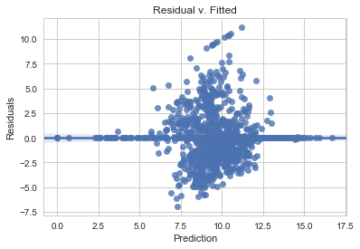


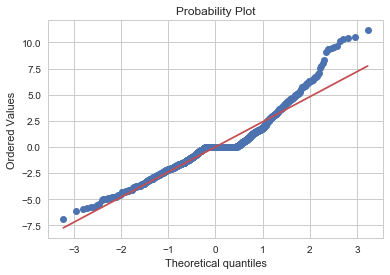


Despite the fact that we violated some key assumptions, we looked further into linear regression to try and remedy the overfitting problem. Utilizing backwards stepwise regression and eliminating insignificant predictors, we hoped to address the problem. With that said, however, we were unsuccessful as we still experienced overfitting. This may seem strange since now there are only 14 predictors, but in examining the predictors the overfitting becomes clear. It makes absolutely no sense to have a significant variable of the interaction between Dua Lipa's presence in a playlist and the amount of country that it has to effect success by an enormous factor of $e^{70}$.

### Backward Stepwise (Baseline)


                                OLS Regression Results                            
    ==============================================================================
    Dep. Variable:              followers   R-squared:                       0.193
    Model:                            OLS   Adj. R-squared:                  0.174
    Method:                 Least Squares   F-statistic:                     9.931
    Date:                Thu, 07 Dec 2017   Prob (F-statistic):           2.32e-35
    Time:                        18:04:58   Log-Likelihood:                -2738.4
    No. Observations:                1106   AIC:                             5531.
    Df Residuals:                    1079   BIC:                             5666.
    Df Model:                          26                                         
    Covariance Type:            nonrobust                                         
    ===============================================================================================
                                      coef    std err          t      P>|t|      [0.025      0.975]
    -----------------------------------------------------------------------------------------------
    num_songs                       0.4178      0.091      4.604      0.000       0.240       0.596
    av_song_pop                     0.8089      0.100      8.064      0.000       0.612       1.006
    rock_pct                       -0.3603      0.094     -3.833      0.000      -0.545      -0.176
    jazz_pct                       -0.2825      0.089     -3.174      0.002      -0.457      -0.108
    percent_international          -2.9708      0.102    -28.999      0.000      -3.172      -2.770
    this_or_not                     1.0514      0.280      3.757      0.000       0.502       1.600
    number_or_not                  -1.2054      0.302     -3.989      0.000      -1.798      -0.613
    BeyoncÌÄå©                     -2.3604      0.756     -3.124      0.002      -3.843      -0.878
    Camila Cabello                  2.9894      1.039      2.876      0.004       0.950       5.029
    Sam Smith                     -12.9714      3.272     -3.965      0.000     -19.391      -6.552
    pct_w_genre                    13.8678      0.149     92.932      0.000      13.575      14.161
    BeyoncÌÄå©*rock_pct             3.8228      1.914      1.997      0.046       0.068       7.578
    Selena Gomez*indie_folk_pct   -10.8001      4.433     -2.436      0.015     -19.498      -2.102
    Marshmello*pop_pct              4.2643      1.843      2.314      0.021       0.649       7.880
    Marshmello*hip_hop_pct        -24.3369     11.535     -2.110      0.035     -46.971      -1.703
    Dua Lipa*pop_pct              -10.7809      1.785     -6.040      0.000     -14.283      -7.279
    Dua Lipa*rnb_pct               58.8222     17.079      3.444      0.001      25.311      92.334
    Camila Cabello*jazz_pct      -752.7325    216.591     -3.475      0.001   -1177.720    -327.745
    Travis Scott*rnb_pct          -16.7147      5.853     -2.856      0.004     -28.198      -5.231
    Taylor Swift*edm_pct          -18.0407      8.021     -2.249      0.025     -33.778      -2.303
    Kendrick Lamar*country_pct     41.6242     21.138      1.969      0.049       0.148      83.101
    Eminem*rock_pct                10.5880      5.195      2.038      0.042       0.395      20.781
    Eminem*metal_pct              -31.9611     11.356     -2.814      0.005     -54.244      -9.678
    Sam Smith*pop_pct              15.5559      4.099      3.795      0.000       7.513      23.599
    Sam Smith*edm_pct              14.1212      4.172      3.385      0.001       5.936      22.307
    Sam Smith*jazz_pct             16.4239      6.324      2.597      0.010       4.015      28.833
    Khalid*pop_pct                  4.2863      1.437      2.983      0.003       1.467       7.105
    Ed Sheeran*classical_pct             0          0        nan        nan           0           0
    Drake*classical_pct                  0          0        nan        nan           0           0
    ==============================================================================
    Omnibus:                      128.021   Durbin-Watson:                   1.927
    Prob(Omnibus):                  0.000   Jarque-Bera (JB):              183.147
    Skew:                          -0.851   Prob(JB):                     1.70e-40
    Kurtosis:                       4.039   Cond. No.                     1.12e+16
    ==============================================================================
    
    Warnings:
    [1] Standard Errors assume that the covariance matrix of the errors is correctly specified.
    [2] The smallest eigenvalue is 1.25e-29. This might indicate that there are
    strong multicollinearity problems or that the design matrix is singular.
    Backwards Stepwise CV Train R^2:  -0.0217653666496


### Lasso

Moving away from pure linear regression, we looked for better success with regularization methods - specifically Lasso and Ridge regression. The main difference between the OLS regression and these regularization methods are that they both introduce a penalty factor. The methods still inherently minimize a loss function (to minimize error), but the penalty factors serve to account for extreme values in parameters. Lasso's penalty form relies on the absolute value of the coefficients while ridge uses the square of the coefficients (notice how both must be positive to increase the loss function and actually serve as a penalty). 


Our hope was that their penalty factors would address the aforementioned problem present within backwards stepwise overfitting whilst still retaining some simplicity of less predictors. Ultimately, these regularization methods did address the overfitting, but had little performance improvement as a result. 


    Lasso Train R^2:  0.147704204575


### Ridge


    Ridge Train R^2:  0.197137758465


```python
data_matrix = [['Model Type', 'Train R^2 CV Performance', 'Overfitting?'],
               ['Full Linear', 'Negative', 'NA'],
               ['Backwards Stepwise', 'Negative', 'NA'],
               ['LassoCV', 0.148, 'Unlikely'],
               ['RidgeCV', 0.197, 'Unlikely']]

table = ff.create_table(data_matrix)
py.iplot(table, filename='simple_table')
```


    High five! You successfully sent some data to your account on plotly. View your plot in your browser at https://plot.ly/~cohenk2/0 or inside your plot.ly account where it is named 'simple_table'


<iframe id="igraph" scrolling="no" style="border:none;" seamless="seamless" src="https://plot.ly/~cohenk2/0.embed" height="200px" width="100%"></iframe>


TODO: Explain this!

## Model B: Classification: Is it Popular?


Since our regression model on the full data set yielded poor results at predicting the number of followers a playlist would have, we thought a useful approach would be to see if classification of a playlist as successful or not (as defined by being in the top quartile of playlists in terms of number of followers) would be more useful.
In terms of metrics to be used for classification, we look both at classification accuracy, AUC, as well as true positive and true negative rates. The AUC and the confusion matrix are the best indication of the success of the classifier, because they highlight the tradeoff between true positives and false positives, true negatives and false negatives, and the shortcomings of using classification accuracy alone in an unbalanced dataset like this one where there are few true positives to detect.


### Logistic Regression with L2 Penalization (Baseline model)

The first baseline model that we preformed for classification was Logistic Regression cross validated with an L2 penalizaiton factor. This model works by calculating the degree to which each predictor affect the log odds of the probability of being successful or not. The log odds is calculated by: log$\left(\dfrac{p}{1-p}\right)$, with p being the probability of a playlist being successful. L2 regularization means that we are attempting to account for overfitting by providing a penalization factor, and is cross validated to give us a sense of accuracy on out of sample observations. This yields a classificaiton accuracy on the train set of $\bf{.758}$, and an AUC of $\bf{.72}$. Though the baseline model has a relatively high AUC, the confusion matrix indicates that this is driven by the high true negative rate. The model is **only correctly predicting 14 of 209 "successful" playlists. We will use this true positive rate as a baseline when comparing all following models**


    CV Train Accurcay 0.75271411339
    CV Test Accuracy 0.758122743682


    array([[610,  10],
           [195,  14]])


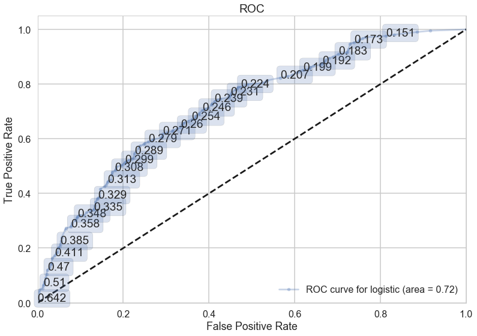


### PCA

Though we use an L2 penalizaiton factor in an attempt to prevent overfitting in the simple logistic regression above, our model still has many predictors (roughly 500), and thus there’s risk of overfitting. Overfitting occurs when our model is highly complex and begins to model the noise in our data due to randomness alone. In addition, there is also potential to overfit since there is so much variation in what creates a successful playlist. One tactic to try and avoid overfitting is to reduce the number of predictors using a process known as Principal Component Analysis, or PCA. PCA attempts to explain the variance observed in our data using features. Each feature is a linear combination of a subset of the predictors; ideally we are able to explain a large amount of the variance with as few features as possible.

In the end, PCA was comparable to the full logistic regression in terms of predictive power, with an AUC of $\bf{.73}$ and a train classification accuracy of $\bf{.76}$. However, in terms of the true positive rate, we see that PCA is outpreforming the baseline, correctly predicting 39 of 209 of successful playlists. In terms of the ultimate goal of interpreting this as to which predictors are relevant towards playlist success, PCA loses much of its interpretability as a model. This is because we are ultimately left with linear combinations of the predictors, they lose their initial interpretations. This makes PCA an unlikely candidate for our ultimate classification model selection.  


    optimal number of components is: 17
    Train Classification Accuracy: 0.7623642943305187
    Test Classification Accuracy: 0.7617328519855595


    array([[593,  27],
           [170,  39]])


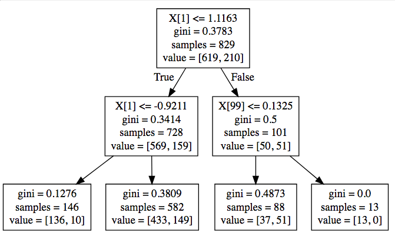


### Decision Tree

A third classification model that we attempted to impliment was the decision tree classifier. We thought this would be a particularly promising model to try because of it's interpretability both to us and Spotify in terms of business applicability. The way decision trees work is by classifying through making cutoffs with certain predictors, in essence saying that for certain values of combinations of predictors indicate a "positive" (successful playlist in this case), and other are indicative of a negative (unsuccessful playlist). 

We cross validated the optimal depth of the tree to be 2 decisions (indicating that few predictors are significant towards predicting playlist significance), and saw an AUC of $\bf{.70}$ and train classification accuracy of $\bf{.76}$. We also see that the model is able to have a true positive rate of 56 out of the 209 successful playlists. This improved true positive rate in comparison with the baseline in combination with the interpretability of Decision Tree as a classifier makes this a strong contender for applicability in determining which playlists will ultimately be successful. 


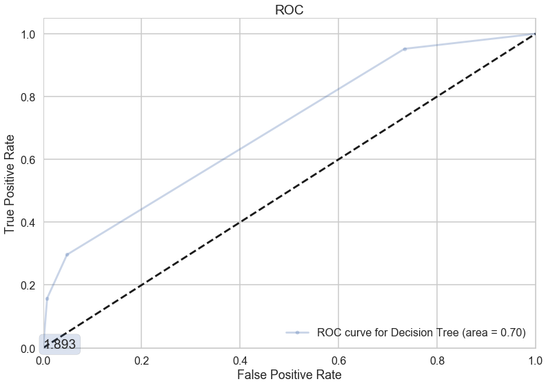


    The optimal tree depth is: 3
    Tree Depth 3 Train Score:  0.794933655006
    Tree Depth 3 Test Score:  0.761732851986
    [[603  17]
     [153  56]]


### K-NN

KNN works in classification by attempting to detect clusters in the data via proximity to other similar data points. In data that is clearly defined, or well separated, this is a particularly powerful tool because distance between points contains a lot of information as to how the observations should ultimately be classified. The limitations of the model in predicting song followers is that due to the subjectivity of any playlist and the variability of what constitutes a successful playlist, even when genre is controlled for, it is unlikely that all successful clusters would be well separated into "successful" and "unsuccessful" playlists. 

Because of this, it is unsurprising that KNN is the worst preformance of the models thus far, with a train prediction accuracy of $\bf{.76}$ and an AUC of $\bf{.72}$. We see that KNN has by far the worst predictive accuracy of all non-baseline models, only correctly predicting 22 of 209 successful playlists as such. We recall that the ultimate goal for these classification models is to gain intuition as to which predictors are relevant in determining playlist success, as measured through number of followes. Because this model has little interpretability, in comparison with its poor true positive rate, we see that this model is not a good choice for our final classification model. 


    KNN 30 Train:  0.762364294331
    KNN 30 Test:  0.761732851986
    Area under the curve knn: 0.524627075711


    array([[610,  10],
           [187,  22]])


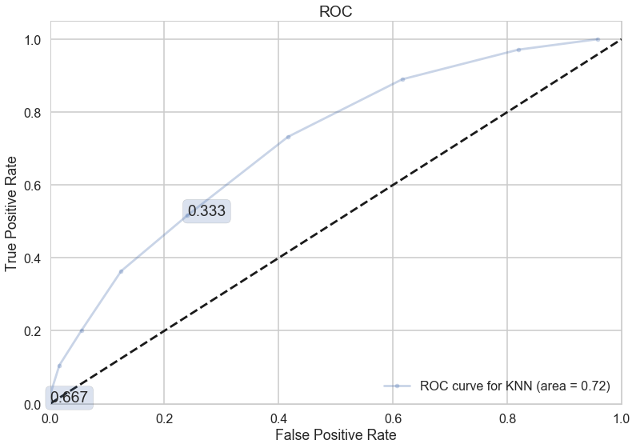


### Random Forest

A random forest is a particularly useful extension of the decision tree. It is an ensemble method in which many independent decision trees are constucted by bootstrapping predictors and taking a random sample of predictors to be used in each tree to form a "random forest". This is often able to out preform a single decision tree by finding new combinations of trees with different leaves in order to improve prediction accuracy. 

The random forest surprisingly did not do as well as the single decision tree, with an AUC of and a classification accuracy of . Because we see that the optimal number of trees in the random forest is only 2, meaning that there isn't a substantial improvement by having more than a single decision tree, this result is not surprising. This is consistent with above findings that very few predictors end up being significant in predicting playlist success. 

The random forest is seen below to have a train prediction accuracy of $\bf{.69}$ and an AUC of $\bf{.79}$. It is also correclty predicting 93 of the 207 successful playlists, which is by far the best of any model. An additional pro of this model is that similar to the decision tree, as the random forest is made up of many decision trees, it too is quite interpretable. The output enables us to have visibility into which predictors are relevant in predicting playlist success, thus making this the best model choice of all tried thus far. 


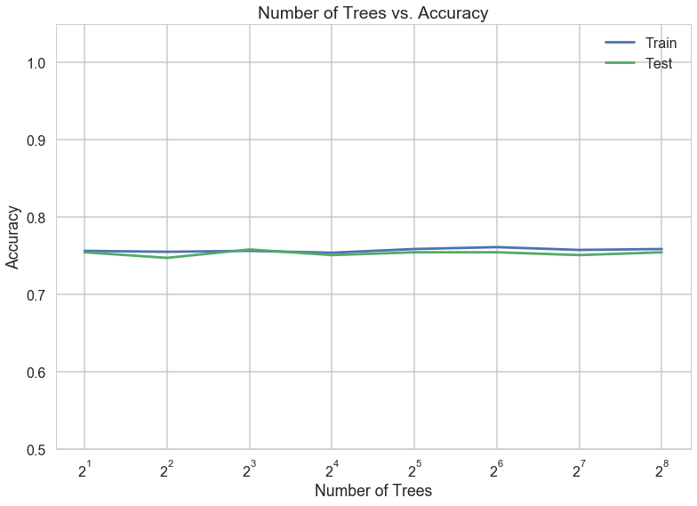


    The ideal # of predictors with 2 trees is: 26


    Test accuracy: 0.692941317941
    Area under the curve: 0.573072051787


    array([[571,  49],
           [116,  93]])


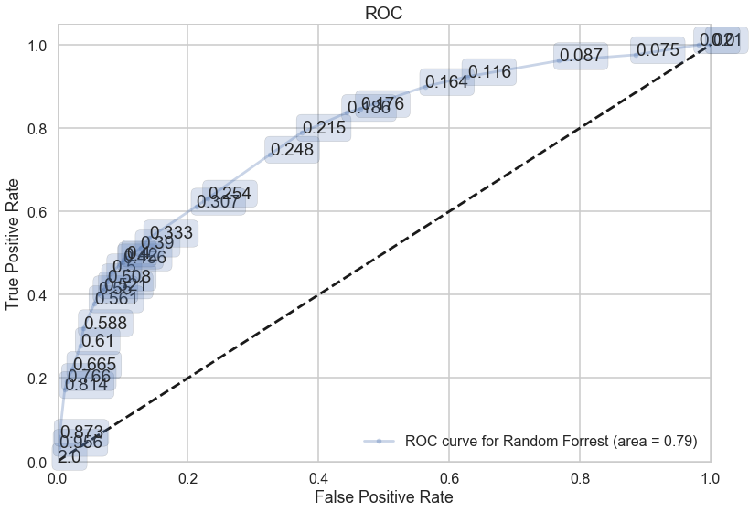


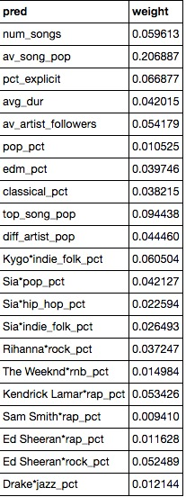


Above is a list of predictors that the random forest output found to be significant for a forest with the optimal number of trees and with each tree having the optimal number of predictors.


```python
data_matrix = [['Model Type', 'AUC Score','Confusion Matrix','Hyperparameters', 'Interpretability'],
               ['Simple Logistic CV', 0.72, confusion_matrix(y_train, log_cv.predict(x_train)), 'L2 Regularization', 'Medium'],
               ['KNN', 0.76 , confusion_matrix(y_train, knn.predict(x_train)), 'Optimal # of neighbors = 12', 'Low'],
               ['PCA', 0.74, confusion_matrix(y_train, logreg_pca.predict(x_train_pca_best)), 'Optimal # of components ', 'Low'],
               ['Decision Tree', 0.68, confusion_matrix(y_train, tree_cv_final.predict(x_train)), 'Optimal Tree Depth = 2', 'High'],
               ['Random Forest', 0.79, confusion_matrix(y_train, rf_opt.predict(x_train)), 'Optimal # Trees = 2, Optimal # Pred = 26', 'High']]

table = ff.create_table(data_matrix)
py.iplot(table, filename='class_table')
```


<iframe id="igraph" scrolling="no" style="border:none;" seamless="seamless" src="https://plot.ly/~cohenk2/2.embed" height="230px" width="100%"></iframe>


### Classification Results

**Final Model Selection**: Ultimately based on the factors we see above for each model, Random Forrest maximizes both AUC (and by extent true positive rate, the metric most important in predicting playlist success, as well as interpretability, and therefore is our choice for the best classification model in predicting a successful playlist.  


Below we run our best classification model, the random forest, on the test data. We see that it has a classification accuracy of .69, and a true positive rate of 40 out of 109. Though this of course is not ideal, given the difficulty in predicting success of a playlist we are relatively satisfied with this model's outcome. 


    Test accuracy: 0.692857142857


    array([[324,  55],
           [ 69,  40]])


## Model C: Regression: How Popular Is Popular?

Since we are now able to predict whether or not a playlist will be popular, we attempt to create a regression model to figure out how successful a playlist that is classified as successful will be. 

Here, we try to create a regression model, trained on the top quartile of playlists, since these are those that we consider "successful." Given that a playlist is successful, our model will tell us how successful it is. Circling back on another attempt to try regression, we decided to refocus and only look at playlists that were deemed popular (in the top quartile of followers). Looking only at this subset then, we recentered our dataset and tried the same regularization methods.

** As a note: ** Here, we skip explaining some of the assumptions underlying the models because we already explained many of the assumptions when we were going through Model A. We follow a similar process below.


<div>
<style>
    .dataframe thead tr:only-child th {
        text-align: right;
    }

    .dataframe thead th {
        text-align: left;
    }

    .dataframe tbody tr th {
        vertical-align: top;
    }
</style>
<table border="1" class="dataframe">
  <thead>
    <tr style="text-align: right;">
      <th></th>
      <th>playlist</th>
      <th>name</th>
      <th>followers</th>
      <th>num_songs</th>
      <th>av_song_pop</th>
      <th>pct_explicit</th>
      <th>avg_dur</th>
      <th>av_artist_followers</th>
      <th>pop_pct</th>
      <th>rap_pct</th>
      <th>...</th>
      <th>Post Malone*rap_pct</th>
      <th>Post Malone*rock_pct</th>
      <th>Post Malone*hip_hop_pct</th>
      <th>Post Malone*country_pct</th>
      <th>Post Malone*metal_pct</th>
      <th>Post Malone*indie_folk_pct</th>
      <th>Post Malone*rnb_pct</th>
      <th>Post Malone*edm_pct</th>
      <th>Post Malone*classical_pct</th>
      <th>Post Malone*jazz_pct</th>
    </tr>
  </thead>
  <tbody>
    <tr>
      <th>0</th>
      <td>37i9dQZF1DXcBWIGoYBM5M</td>
      <td>Today's Top Hits</td>
      <td>4.711236</td>
      <td>-0.095155</td>
      <td>2.767125</td>
      <td>1.329673</td>
      <td>-0.352106</td>
      <td>1.131506</td>
      <td>0.999423</td>
      <td>0.889318</td>
      <td>...</td>
      <td>0.36</td>
      <td>0.0</td>
      <td>0.12</td>
      <td>0.0</td>
      <td>0.0</td>
      <td>0.08</td>
      <td>0.02</td>
      <td>0.22</td>
      <td>0.0</td>
      <td>0.0</td>
    </tr>
    <tr>
      <th>1</th>
      <td>37i9dQZF1DX3LyU0mhfqgP</td>
      <td>Out Now</td>
      <td>0.992308</td>
      <td>0.104091</td>
      <td>2.094954</td>
      <td>0.493535</td>
      <td>-0.356516</td>
      <td>0.654250</td>
      <td>0.596919</td>
      <td>-0.250860</td>
      <td>...</td>
      <td>0.00</td>
      <td>0.0</td>
      <td>0.00</td>
      <td>0.0</td>
      <td>0.0</td>
      <td>0.00</td>
      <td>0.00</td>
      <td>0.00</td>
      <td>0.0</td>
      <td>0.0</td>
    </tr>
    <tr>
      <th>5</th>
      <td>37i9dQZF1DWU13kKnk03AP</td>
      <td>Daily Lift</td>
      <td>1.791751</td>
      <td>-0.055306</td>
      <td>2.280426</td>
      <td>0.465268</td>
      <td>-0.406380</td>
      <td>0.795643</td>
      <td>1.118793</td>
      <td>0.083071</td>
      <td>...</td>
      <td>0.00</td>
      <td>0.0</td>
      <td>0.00</td>
      <td>0.0</td>
      <td>0.0</td>
      <td>0.00</td>
      <td>0.00</td>
      <td>0.00</td>
      <td>0.0</td>
      <td>0.0</td>
    </tr>
    <tr>
      <th>7</th>
      <td>37i9dQZF1DX1dvMSwf27JO</td>
      <td>Study Break</td>
      <td>0.891364</td>
      <td>0.183789</td>
      <td>1.435792</td>
      <td>0.367078</td>
      <td>-0.352594</td>
      <td>0.882897</td>
      <td>1.164485</td>
      <td>-0.191357</td>
      <td>...</td>
      <td>0.00</td>
      <td>0.0</td>
      <td>0.00</td>
      <td>0.0</td>
      <td>0.0</td>
      <td>0.00</td>
      <td>0.00</td>
      <td>0.00</td>
      <td>0.0</td>
      <td>0.0</td>
    </tr>
    <tr>
      <th>12</th>
      <td>37i9dQZF1DWUACcBjzMiIY</td>
      <td>Mellow Nights</td>
      <td>1.506135</td>
      <td>0.183789</td>
      <td>1.212179</td>
      <td>-0.374806</td>
      <td>-0.186847</td>
      <td>1.255306</td>
      <td>1.504319</td>
      <td>-0.330619</td>
      <td>...</td>
      <td>0.00</td>
      <td>0.0</td>
      <td>0.00</td>
      <td>0.0</td>
      <td>0.0</td>
      <td>0.00</td>
      <td>0.00</td>
      <td>0.00</td>
      <td>0.0</td>
      <td>0.0</td>
    </tr>
  </tbody>
</table>
<p>5 rows × 513 columns</p>
</div>


This is a substantial change by which we have essentially eliminated about 75% of our data. With this big change, we did see a slight uptick in performance, but unfortunately nothing substantial. We start first with a Full Linear Model.

### Full Linear Regression Model


Since there are far too many predictors in the full linear regression model, we will suppress the output. Instead, we try a Backward Stepwise regression to eliminate some of the predictors and prevent overfitting.

### Backward Stepise for Linear Regression


                                OLS Regression Results                            
    ==============================================================================
    Dep. Variable:              followers   R-squared:                       0.277
    Model:                            OLS   Adj. R-squared:                  0.255
    Method:                 Least Squares   F-statistic:                     12.51
    Date:                Thu, 07 Dec 2017   Prob (F-statistic):           6.40e-12
    Time:                        18:05:18   Log-Likelihood:                -306.91
    No. Observations:                 202   AIC:                             625.8
    Df Residuals:                     196   BIC:                             645.7
    Df Model:                           6                                         
    Covariance Type:            nonrobust                                         
    ============================================================================================
                                   coef    std err          t      P>|t|      [0.025      0.975]
    --------------------------------------------------------------------------------------------
    av_song_pop                  0.3487      0.098      3.563      0.000       0.156       0.542
    classical_pct               -0.2559      0.092     -2.783      0.006      -0.437      -0.075
    this_or_not                 -0.8966      0.264     -3.401      0.001      -1.417      -0.377
    Drake                       -1.6898      0.621     -2.723      0.007      -2.913      -0.466
    pct_w_genre                 -0.5887      0.122     -4.814      0.000      -0.830      -0.348
    Ozuna*country_pct                 0          0        nan        nan           0           0
    Ozuna*metal_pct                   0          0        nan        nan           0           0
    Ozuna*indie_folk_pct              0          0        nan        nan           0           0
    Ozuna*edm_pct                     0          0        nan        nan           0           0
    Ozuna*classical_pct               0          0        nan        nan           0           0
    Ozuna*jazz_pct                    0          0        nan        nan           0           0
    Bad Bunny*country_pct             0          0        nan        nan           0           0
    Bad Bunny*metal_pct               0          0        nan        nan           0           0
    Bad Bunny*indie_folk_pct          0          0        nan        nan           0           0
    Bad Bunny*edm_pct                 0          0        nan        nan           0           0
    Bad Bunny*classical_pct           0          0        nan        nan           0           0
    Bad Bunny*jazz_pct                0          0        nan        nan           0           0
    Khalid*classical_pct              0          0        nan        nan           0           0
    Khalid*jazz_pct                   0          0        nan        nan           0           0
    Ed Sheeran*classical_pct          0          0        nan        nan           0           0
    Drake*rap_pct                2.0227      0.830      2.438      0.016       0.386       3.659
    Drake*metal_pct                   0          0        nan        nan           0           0
    Drake*classical_pct               0          0        nan        nan           0           0
    ==============================================================================
    Omnibus:                       35.086   Durbin-Watson:                   2.016
    Prob(Omnibus):                  0.000   Jarque-Bera (JB):               47.977
    Skew:                          -1.070   Prob(JB):                     3.82e-11
    Kurtosis:                       4.058   Cond. No.                          inf
    ==============================================================================
    
    Warnings:
    [1] Standard Errors assume that the covariance matrix of the errors is correctly specified.
    [2] The smallest eigenvalue is      0. This might indicate that there are
    strong multicollinearity problems or that the design matrix is singular.
    Backwards Stepwise CV Train R^2:  0.131344375103


    Backwards Stepwise Test R^2:  -0.0472257109862


Since we see a particularly bad test R^2 score, we go ahead and try other regression methods that we have learned, such as Ridge and Lasso Regularizations. We begin with those below.

### Ridge Regression


    Ridge Train R^2:  0.30895531482
    Ridge Test R^2:  -0.0257503367149


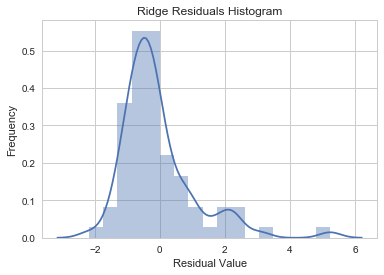


Above, we see the histogram of the residuals, which seems relatively right skewed and not centered around 0, which is an issue. Let's try Lasso Regression, now.

### Lasso Regression


    Lasso Train R^2:  0.229580517999
    Lasso Test R^2:  -0.0155792592175


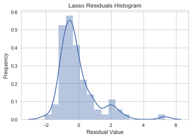


Above, we see the histogram of the residuals for Lasso, which seems relatively right skewed and not centered around 0, which is an issue.

We can take a higher level look at all of our models and compare their potentials, but really since all of these models have negative test $R^2$ values there really doesn't seem to be much here and we need to look elsewhere moving forward.


Of the above four models, we would choose the Cross Validated Ridge Model. We say this for a couple of reasons.
1. First, the Ridge Model uses regularization methods to decrease the bias caused be certain variables. This is particularly important in a case like this when we have so many predictors and comparatively fewer variables.
2. Second, the Ridge Model is easily interpretable-- we have listed the significant coefficients above (with regularization penalty). This is great news in terms of whether or not Spotify will actually be able to make use of our findings. 
3. The histogram of the residuals is still left skewed, but that is true of the residuals for Lasso as well, so this point is essentially a wash. 
4. The Ridge Train R^2 is relatively high (though we acknowledge the high likelihood of overfitting).


** Discussion of Significant Variables **

Here we attempt to discuss the most significant variables. The variable that seems to contribute most positively to increased success in a playlist is increasing the average song popularity, which intuitively makes sense since these songs tend to draw people in. Additioanlly, the "top or not" variable, which accounts for words like "Hot", "Top", or "viral" in the playlist name, increases success-- this may be because of confounding factors like Spotify being more likely to increase the visibility of these playlists. The average popularity of the top 3 artists, the range of artist popularity, and the presence of Rihanna or JBalvin in the playlist increases the success of the playlist. 

Conversely, the higher the popularity of the top artist and song, the lower the success of the playlist (which is intuitively surprising!-- of course, this is a good time to mention the possibility of errors like multicollinearity, etc.). The percentage of rock and classical songs, the presence of The Weeknd and Drake, the presence of a number or the words "This Is:" in the playlist title reduces the success of the playlist.

### Regression Results

Here we see that while we were able to increase the Training R^2 of our dataset, the Test R^2 of the data was still particularly bad-- in fact, all Test R^2s were negative. This intuitively makes sense because with so many predictors and so few data (since we dropped so many of our observations), we are very likely to overfit. Despite using regularization methods like Lasso and Ridge to reduce the effectiveness of unnecessary variables, we still find that the models are quite bad. 

At this point, it feels as though we have tried everything and conclude that no regression model can effectively predict the number of followers our playlist will have. Though regression methods appear to be pretty useless here, we do note the everall effectiveness of the classification model in determining whether or not a playlist will perform in the top 25% of playlists.


```python

```

