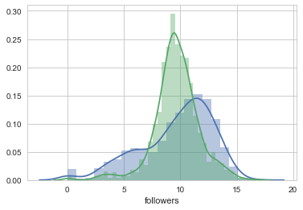
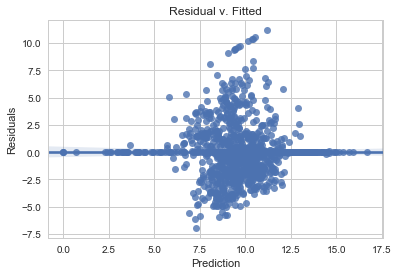
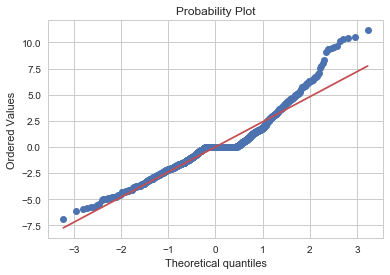

Import libraries:


#### Our Modeling Journey

Our journey in model creation had a variety of different phases as we iterated through the process running into roadblocks, circled back to try a different method or approach, and then repeated. Looking at an overview of what that actually meant for us we can briefly trace the outline of our steps and then walk through it.
1. Initially, we ran various regressions (linear and regularization-based) on approximately 70 predictor variables. Despite multiple efforts we could not find any model that performed well.
2. Adjusting for this, we went back to our data and bolstered it with additional indicators, interaction terms, and unique predictors we intuitively thought were useful. Running the same models on this data, we still had poor performance (even on our best cross validated Ridge Regression model).
3. Thinking our data was still being negatively effected by the skew of playlist followers, we decided to only look at the popular playlists that we ultimately are seeking to generate. Using our new bolstered dataset on this subset, we saw mildly improved performance, but nothing substantial enough to gain incredible insights from.
4. Moving away from regression, we decided to switch our focus to classification instead. We defined a success as being known as a 'popular' playlist above our follower threshold and undertook numerous classification models. Ultimately, a Random Forest Classification model proved to be the best model for us throughout the entire journey. 

#### Full Modeling

One of the goals of our project was to be able to predict the number of followers of a playlist, given a number of songs and their artists. Our first, and simplest predictive model was the Ordinary Least-Squares Multiple Linear Regression Model, which aims to minimize the error produced by a linear function of our predictors. In this case, error is defined by taking the mean of our squared residuals (the actual number of followers - our predicted number). This linear function of our predictors provides us with a simple equation relating our predictors, such as average artist popularity or song duration, to our response variable, the number of followers of a playlist.

The benefit of this simple model is that it’s highly interpretable and easy to understand. However, due to the simplicity of the model, there are definitely assumptions that we must account for.
1. Normality: our residuals should be normally distributed. We check this below using a residual vs. fitted plot.
2. Equal Variance: We should have the same variance with each observation; we can also check this below with the residual plot below.
3. Linearity: Our predictors should have a linear relationship with our response; we can observe whether this is violated by checking to see if there are any patterns or any curvature in the residual plot below. Additionally, we saw some of these relationships directly in our EDA. 
4. Independence: Our predictors should be linearly independent, if not, there is multicollinearity in our model. We can account for this by removing predictors that are highly correlated.


<div>
<style>
    .dataframe thead tr:only-child th {
        text-align: right;
    }

    .dataframe thead th {
        text-align: left;
    }

    .dataframe tbody tr th {
        vertical-align: top;
    }
</style>
<table border="1" class="dataframe">
  <thead>
    <tr style="text-align: right;">
      <th></th>
      <th>playlist</th>
      <th>name</th>
      <th>followers</th>
      <th>num_songs</th>
      <th>av_song_pop</th>
      <th>pct_explicit</th>
      <th>avg_dur</th>
      <th>av_artist_followers</th>
      <th>pop_pct</th>
      <th>rap_pct</th>
      <th>...</th>
      <th>Post Malone*rap_pct</th>
      <th>Post Malone*rock_pct</th>
      <th>Post Malone*hip_hop_pct</th>
      <th>Post Malone*country_pct</th>
      <th>Post Malone*metal_pct</th>
      <th>Post Malone*indie_folk_pct</th>
      <th>Post Malone*rnb_pct</th>
      <th>Post Malone*edm_pct</th>
      <th>Post Malone*classical_pct</th>
      <th>Post Malone*jazz_pct</th>
    </tr>
  </thead>
  <tbody>
    <tr>
      <th>0</th>
      <td>37i9dQZF1DXcBWIGoYBM5M</td>
      <td>Today's Top Hits</td>
      <td>16.712741</td>
      <td>-0.095155</td>
      <td>2.767125</td>
      <td>1.329673</td>
      <td>-0.352106</td>
      <td>1.131506</td>
      <td>0.999423</td>
      <td>0.889318</td>
      <td>...</td>
      <td>0.36</td>
      <td>0.00</td>
      <td>0.12</td>
      <td>0.0</td>
      <td>0.0</td>
      <td>0.08</td>
      <td>0.02</td>
      <td>0.22</td>
      <td>0.0</td>
      <td>0.0</td>
    </tr>
    <tr>
      <th>1</th>
      <td>37i9dQZF1DX3LyU0mhfqgP</td>
      <td>Out Now</td>
      <td>12.993814</td>
      <td>0.104091</td>
      <td>2.094954</td>
      <td>0.493535</td>
      <td>-0.356516</td>
      <td>0.654250</td>
      <td>0.596919</td>
      <td>-0.250860</td>
      <td>...</td>
      <td>0.00</td>
      <td>0.00</td>
      <td>0.00</td>
      <td>0.0</td>
      <td>0.0</td>
      <td>0.00</td>
      <td>0.00</td>
      <td>0.00</td>
      <td>0.0</td>
      <td>0.0</td>
    </tr>
    <tr>
      <th>2</th>
      <td>37i9dQZF1DX7Axsg3uaDZb</td>
      <td>Top Tracks of 2016 - USA</td>
      <td>8.558527</td>
      <td>1.897301</td>
      <td>1.931070</td>
      <td>1.911124</td>
      <td>-0.291292</td>
      <td>1.401707</td>
      <td>1.386834</td>
      <td>1.246525</td>
      <td>...</td>
      <td>0.45</td>
      <td>0.07</td>
      <td>0.25</td>
      <td>0.0</td>
      <td>0.0</td>
      <td>0.08</td>
      <td>0.06</td>
      <td>0.19</td>
      <td>0.0</td>
      <td>0.0</td>
    </tr>
    <tr>
      <th>3</th>
      <td>37i9dQZF1DWWoCDtOBjhpE</td>
      <td>Top Female Artists of 2016 - USA</td>
      <td>0.000000</td>
      <td>-1.290629</td>
      <td>1.708333</td>
      <td>0.589643</td>
      <td>-0.230856</td>
      <td>1.427494</td>
      <td>1.552867</td>
      <td>0.055833</td>
      <td>...</td>
      <td>0.00</td>
      <td>0.00</td>
      <td>0.00</td>
      <td>0.0</td>
      <td>0.0</td>
      <td>0.00</td>
      <td>0.00</td>
      <td>0.00</td>
      <td>0.0</td>
      <td>0.0</td>
    </tr>
    <tr>
      <th>4</th>
      <td>7qLIVhpCFAiX1Teqf3L6Y4</td>
      <td>Happy Birthday Cheryl!</td>
      <td>5.332719</td>
      <td>-0.892138</td>
      <td>-0.386537</td>
      <td>-0.467542</td>
      <td>-0.284179</td>
      <td>0.829675</td>
      <td>1.091664</td>
      <td>0.254282</td>
      <td>...</td>
      <td>0.00</td>
      <td>0.00</td>
      <td>0.00</td>
      <td>0.0</td>
      <td>0.0</td>
      <td>0.00</td>
      <td>0.00</td>
      <td>0.00</td>
      <td>0.0</td>
      <td>0.0</td>
    </tr>
  </tbody>
</table>
<p>5 rows × 513 columns</p>
</div>


We initially ran was an ordinary least squares regression using all predictors. This resulted in severe overfitting because of the abundance of predictors we had when compared to the actual number of playlists that we were trying to predict from. We know that we're overfitting the data because all of our training set $R^2$ values are incredibly high around 0.9, but the test and cross validated $R^2$ values were either 0 or even negative.


    Full Model CV R^2:  -6.84646555406


Despite the overfitting problem, we want to look and see if linear regression is even a good fit at all and whether or not we violate any of the assumptions necessary for a model like this to work. Generally, for linear regression to be valid we want data that is normally distributed. As discussed in the EDA section, playlist followers are heavily right skewed so we performed a log transformation. Even with this transformation, however, the data was still rather far from normal which caused some reverberating problems throughout our models. Additionally, there were no directly apparent linear relationships present between our predictors and response variables nor any visible helpful transformations.

Looking at the models themselves, we can see if their inherent assumptions held. The first assumption for our model to be valid is that our residuals are normally distributed with mean 0 and a constant variance. Looking at the distribution of our residuals we can see that the mean is indeed 0, however they don't look like they have constant variance as we have far more positive residuals than negatives. Indeed, looking at our fitted values for log followers when compared to the true number of followers, as well as a quantile-quantile plot we tend to generally predict far too many playlists to be located around the mean of the true dataset.


    count    1.106000e+03
    mean    -2.442852e-13
    std      2.486787e+00
    min     -6.941227e+00
    25%     -1.500287e+00
    50%     -1.330935e-12
    75%      7.345288e-01
    max      1.117090e+01
    dtype: float64





    <matplotlib.text.Text at 0x1174f60f0>








Despite the fact that we violated some key assumptions, we looked further into linear regression to try and remedy the overfitting problem. Utilizing backwards stepwise regression and eliminating insignificant predictors, we hoped to address the problem. With that said, however, we were unsuccessful as we still experienced overfitting. This may seem strange since now there are only 14 predictors, but in examining the predictors the overfitting becomes clear. It makes absolutely no sense to have a significant variable of the interaction between Dua Lipa's presence in a playlist and the amount of country that it has to effect success by an enormous factor of $e^{70}$.


                                OLS Regression Results                            
    ==============================================================================
    Dep. Variable:              followers   R-squared:                       0.193
    Model:                            OLS   Adj. R-squared:                  0.174
    Method:                 Least Squares   F-statistic:                     9.931
    Date:                Thu, 07 Dec 2017   Prob (F-statistic):           2.32e-35
    Time:                        13:14:23   Log-Likelihood:                -2738.4
    No. Observations:                1106   AIC:                             5531.
    Df Residuals:                    1079   BIC:                             5666.
    Df Model:                          26                                         
    Covariance Type:            nonrobust                                         
    ===============================================================================================
                                      coef    std err          t      P>|t|      [0.025      0.975]
    -----------------------------------------------------------------------------------------------
    num_songs                       0.4178      0.091      4.604      0.000       0.240       0.596
    av_song_pop                     0.8089      0.100      8.064      0.000       0.612       1.006
    rock_pct                       -0.3603      0.094     -3.833      0.000      -0.545      -0.176
    jazz_pct                       -0.2825      0.089     -3.174      0.002      -0.457      -0.108
    percent_international          -2.9708      0.102    -28.999      0.000      -3.172      -2.770
    this_or_not                     1.0514      0.280      3.757      0.000       0.502       1.600
    number_or_not                  -1.2054      0.302     -3.989      0.000      -1.798      -0.613
    BeyoncÌÄå©                     -2.3604      0.756     -3.124      0.002      -3.843      -0.878
    Camila Cabello                  2.9894      1.039      2.876      0.004       0.950       5.029
    Sam Smith                     -12.9714      3.272     -3.965      0.000     -19.391      -6.552
    pct_w_genre                    13.8678      0.149     92.932      0.000      13.575      14.161
    BeyoncÌÄå©*rock_pct             3.8228      1.914      1.997      0.046       0.068       7.578
    Selena Gomez*indie_folk_pct   -10.8001      4.433     -2.436      0.015     -19.498      -2.102
    Marshmello*pop_pct              4.2643      1.843      2.314      0.021       0.649       7.880
    Marshmello*hip_hop_pct        -24.3369     11.535     -2.110      0.035     -46.971      -1.703
    Dua Lipa*pop_pct              -10.7809      1.785     -6.040      0.000     -14.283      -7.279
    Dua Lipa*rnb_pct               58.8222     17.079      3.444      0.001      25.311      92.334
    Camila Cabello*jazz_pct      -752.7325    216.591     -3.475      0.001   -1177.720    -327.745
    Travis Scott*rnb_pct          -16.7147      5.853     -2.856      0.004     -28.198      -5.231
    Taylor Swift*edm_pct          -18.0407      8.021     -2.249      0.025     -33.778      -2.303
    Kendrick Lamar*country_pct     41.6242     21.138      1.969      0.049       0.148      83.101
    Eminem*rock_pct                10.5880      5.195      2.038      0.042       0.395      20.781
    Eminem*metal_pct              -31.9611     11.356     -2.814      0.005     -54.244      -9.678
    Sam Smith*pop_pct              15.5559      4.099      3.795      0.000       7.513      23.599
    Sam Smith*edm_pct              14.1212      4.172      3.385      0.001       5.936      22.307
    Sam Smith*jazz_pct             16.4239      6.324      2.597      0.010       4.015      28.833
    Khalid*pop_pct                  4.2863      1.437      2.983      0.003       1.467       7.105
    Ed Sheeran*classical_pct             0          0        nan        nan           0           0
    Drake*classical_pct                  0          0        nan        nan           0           0
    ==============================================================================
    Omnibus:                      128.021   Durbin-Watson:                   1.927
    Prob(Omnibus):                  0.000   Jarque-Bera (JB):              183.147
    Skew:                          -0.851   Prob(JB):                     1.70e-40
    Kurtosis:                       4.039   Cond. No.                     1.12e+16
    ==============================================================================
    
    Warnings:
    [1] Standard Errors assume that the covariance matrix of the errors is correctly specified.
    [2] The smallest eigenvalue is 1.25e-29. This might indicate that there are
    strong multicollinearity problems or that the design matrix is singular.
    Backwards Stepwise CV Train R^2:  -0.0217653666496


Moving away from pure linear regression, we looked for better success with regularization methods - specifically Lasso and Ridge regression. The main difference between the OLS regression and these regularization methods are that they both introduce a penalty factor. The methods still inherently minimize a loss function (to minimize error), but the penalty factors serve to account for extreme values in parameters. Lasso's penalty form relies on the absolute value of the coefficients while ridge uses the square of the coefficients (notice how both must be positive to increase the loss function and actually serve as a penalty). 


Our hope was that their penalty factors would address the aforementioned problem present within backwards stepwise overfitting whilst still retaining some simplicity of less predictors. Ultimately, these regularization methods did address the overfitting, but had little performance improvement as a result. 


    Lasso Train R^2:  0.147704204575


    Ridge Train R^2:  0.197137758465


#### Popular Subset

Circling back on another attempt to try regression, we decided to refocus and only look at playlists that were deemed popular (in the top quartile of followers). Looking only at this subset then, we recentered our dataset and tried the same regularization methods.


<div>
<style>
    .dataframe thead tr:only-child th {
        text-align: right;
    }

    .dataframe thead th {
        text-align: left;
    }

    .dataframe tbody tr th {
        vertical-align: top;
    }
</style>
<table border="1" class="dataframe">
  <thead>
    <tr style="text-align: right;">
      <th></th>
      <th>playlist</th>
      <th>name</th>
      <th>followers</th>
      <th>num_songs</th>
      <th>av_song_pop</th>
      <th>pct_explicit</th>
      <th>avg_dur</th>
      <th>av_artist_followers</th>
      <th>pop_pct</th>
      <th>rap_pct</th>
      <th>...</th>
      <th>Post Malone*rap_pct</th>
      <th>Post Malone*rock_pct</th>
      <th>Post Malone*hip_hop_pct</th>
      <th>Post Malone*country_pct</th>
      <th>Post Malone*metal_pct</th>
      <th>Post Malone*indie_folk_pct</th>
      <th>Post Malone*rnb_pct</th>
      <th>Post Malone*edm_pct</th>
      <th>Post Malone*classical_pct</th>
      <th>Post Malone*jazz_pct</th>
    </tr>
  </thead>
  <tbody>
    <tr>
      <th>0</th>
      <td>37i9dQZF1DXcBWIGoYBM5M</td>
      <td>Today's Top Hits</td>
      <td>4.711236</td>
      <td>-0.095155</td>
      <td>2.767125</td>
      <td>1.329673</td>
      <td>-0.352106</td>
      <td>1.131506</td>
      <td>0.999423</td>
      <td>0.889318</td>
      <td>...</td>
      <td>0.36</td>
      <td>0.0</td>
      <td>0.12</td>
      <td>0.0</td>
      <td>0.0</td>
      <td>0.08</td>
      <td>0.02</td>
      <td>0.22</td>
      <td>0.0</td>
      <td>0.0</td>
    </tr>
    <tr>
      <th>1</th>
      <td>37i9dQZF1DX3LyU0mhfqgP</td>
      <td>Out Now</td>
      <td>0.992308</td>
      <td>0.104091</td>
      <td>2.094954</td>
      <td>0.493535</td>
      <td>-0.356516</td>
      <td>0.654250</td>
      <td>0.596919</td>
      <td>-0.250860</td>
      <td>...</td>
      <td>0.00</td>
      <td>0.0</td>
      <td>0.00</td>
      <td>0.0</td>
      <td>0.0</td>
      <td>0.00</td>
      <td>0.00</td>
      <td>0.00</td>
      <td>0.0</td>
      <td>0.0</td>
    </tr>
    <tr>
      <th>5</th>
      <td>37i9dQZF1DWU13kKnk03AP</td>
      <td>Daily Lift</td>
      <td>1.791751</td>
      <td>-0.055306</td>
      <td>2.280426</td>
      <td>0.465268</td>
      <td>-0.406380</td>
      <td>0.795643</td>
      <td>1.118793</td>
      <td>0.083071</td>
      <td>...</td>
      <td>0.00</td>
      <td>0.0</td>
      <td>0.00</td>
      <td>0.0</td>
      <td>0.0</td>
      <td>0.00</td>
      <td>0.00</td>
      <td>0.00</td>
      <td>0.0</td>
      <td>0.0</td>
    </tr>
    <tr>
      <th>7</th>
      <td>37i9dQZF1DX1dvMSwf27JO</td>
      <td>Study Break</td>
      <td>0.891364</td>
      <td>0.183789</td>
      <td>1.435792</td>
      <td>0.367078</td>
      <td>-0.352594</td>
      <td>0.882897</td>
      <td>1.164485</td>
      <td>-0.191357</td>
      <td>...</td>
      <td>0.00</td>
      <td>0.0</td>
      <td>0.00</td>
      <td>0.0</td>
      <td>0.0</td>
      <td>0.00</td>
      <td>0.00</td>
      <td>0.00</td>
      <td>0.0</td>
      <td>0.0</td>
    </tr>
    <tr>
      <th>12</th>
      <td>37i9dQZF1DWUACcBjzMiIY</td>
      <td>Mellow Nights</td>
      <td>1.506135</td>
      <td>0.183789</td>
      <td>1.212179</td>
      <td>-0.374806</td>
      <td>-0.186847</td>
      <td>1.255306</td>
      <td>1.504319</td>
      <td>-0.330619</td>
      <td>...</td>
      <td>0.00</td>
      <td>0.0</td>
      <td>0.00</td>
      <td>0.0</td>
      <td>0.0</td>
      <td>0.00</td>
      <td>0.00</td>
      <td>0.00</td>
      <td>0.0</td>
      <td>0.0</td>
    </tr>
  </tbody>
</table>
<p>5 rows × 513 columns</p>
</div>


With this big change, we did see a slight uptick in performance, but unfortunately nothing substantial.


    Ridge Train R^2:  0.324045167308
    Ridge Test R^2:  -0.187883090485
    Lasso Train R^2:  0.18823571324
    Lasso Test R^2:  -0.102655312018


```python
coef_vals = ridge_reg.coef_
factors = pd.DataFrame(coef_vals, columns = ['Coefficient'])
factors['Variable'] = x_train.columns
factors = factors.sort_values('Coefficient')
factors[abs(factors['Coefficient']) > 0.15]
```


<div>
<style>
    .dataframe thead tr:only-child th {
        text-align: right;
    }

    .dataframe thead th {
        text-align: left;
    }

    .dataframe tbody tr th {
        vertical-align: top;
    }
</style>
<table border="1" class="dataframe">
  <thead>
    <tr style="text-align: right;">
      <th></th>
      <th>Coefficient</th>
      <th>Variable</th>
    </tr>
  </thead>
  <tbody>
    <tr>
      <th>14</th>
      <td>-0.413052</td>
      <td>classical_pct</td>
    </tr>
    <tr>
      <th>67</th>
      <td>-0.321790</td>
      <td>Drake</td>
    </tr>
    <tr>
      <th>20</th>
      <td>-0.214041</td>
      <td>top_song_pop</td>
    </tr>
    <tr>
      <th>27</th>
      <td>-0.214000</td>
      <td>this_or_not</td>
    </tr>
    <tr>
      <th>49</th>
      <td>-0.187792</td>
      <td>The Weeknd</td>
    </tr>
    <tr>
      <th>44</th>
      <td>-0.173901</td>
      <td>Imagine Dragons</td>
    </tr>
    <tr>
      <th>61</th>
      <td>-0.167843</td>
      <td>Sam Smith</td>
    </tr>
    <tr>
      <th>16</th>
      <td>-0.162958</td>
      <td>popular_artist_pct</td>
    </tr>
    <tr>
      <th>60</th>
      <td>0.191890</td>
      <td>J Balvin</td>
    </tr>
    <tr>
      <th>38</th>
      <td>0.245761</td>
      <td>Dua Lipa</td>
    </tr>
    <tr>
      <th>34</th>
      <td>0.246925</td>
      <td>Marshmello</td>
    </tr>
    <tr>
      <th>1</th>
      <td>0.466326</td>
      <td>av_song_pop</td>
    </tr>
  </tbody>
</table>
</div>


We can take a higher level look at all of our models and compare their potentials, but really since all of these models have negative test $R^2$ values there really doesn't seem to be much here and we need to look elsewhere moving forward.


    High five! You successfully sent some data to your account on plotly. View your plot in your browser at https://plot.ly/~cohenk2/0 or inside your plot.ly account where it is named 'simple_table'


<iframe id="igraph" scrolling="no" style="border:none;" seamless="seamless" src="https://plot.ly/~cohenk2/0.embed" height="200px" width="100%"></iframe>


Since we didn't see any increased performance here, we decided to shift our focus to classificaiton. Now, instead of trying to predict the exact number of followers, we defined a successful playlist as one above our threshold of 163K followers. Reshaping our question then, we were able to see some performance improvement.


```python

```

